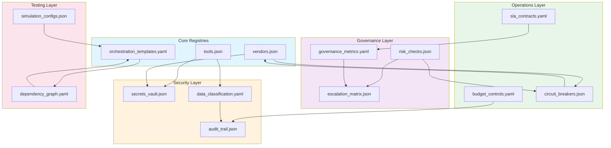
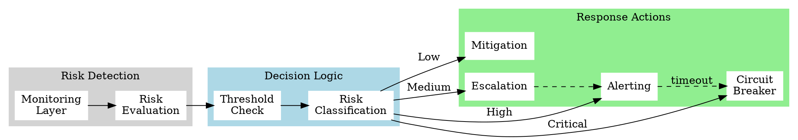
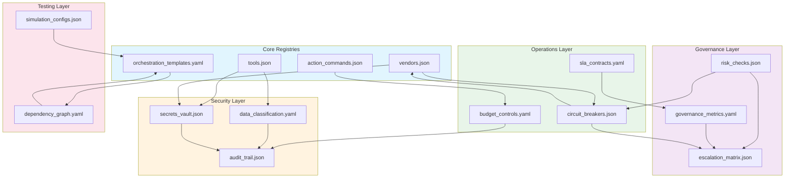
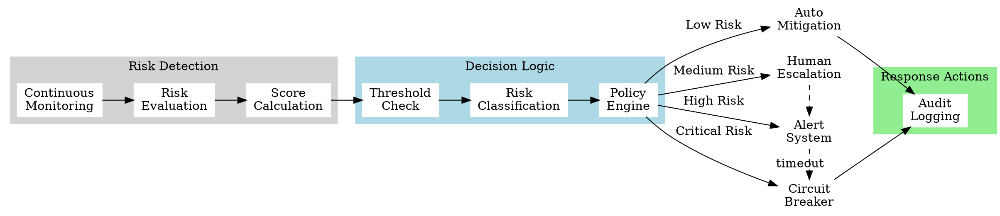
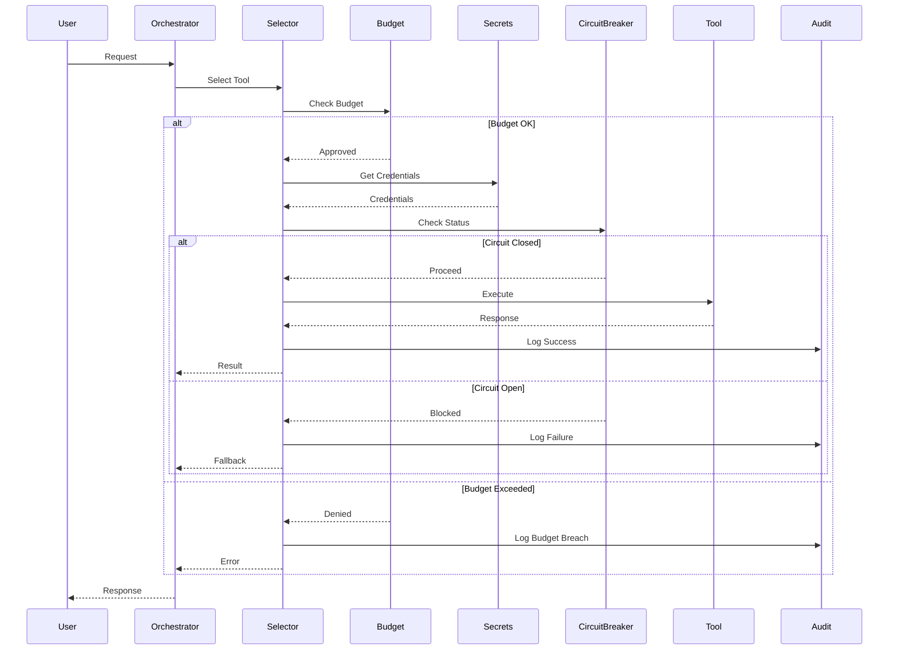

# Alpha Solver Tool Registry Expansion

**Created:** 8/30/2025 19:12:03  
**Updated:** 8/31/2025 10:21:34  
**Exported:** 9/2/2025 21:26:01  
**Link:** [https://claude.ai/chat/d0c30d49-8f76-43a0-93b4-5ddcb8d6021d](https://claude.ai/chat/d0c30d49-8f76-43a0-93b4-5ddcb8d6021d)  

## Prompt:
8/30/2025, 7:12:04 PM

Project Artifact to Build On:
# Alpha Solver Tool Registry Expansion: Strategic Research Brief
(This artifact identified 89 candidate tools across robotics, legal, biotech, integration, regional AI, creative tools, and hardware systems. It also flagged white space in patents around hardware-AI integration, multimodal compliance monitoring, and cross-jurisdictional governance.)

---

## Your Role
You are acting as a **strategic foresight research council** expanding the Alpha Solver registry. Combine expert hats:
- **Systems Architect** (map tool synergies across domains, e.g., robotics + IoT + legal compliance in one workflow).
- **Regional AI Analyst** (China, EU, India, LatAm — identify sovereign or fast-growing ecosystems).
- **Patent Engineer** (translate identified white space into candidate architectures and workflows Alpha Solver could patent).
- **Adoption Forecaster** (predict which tools/frameworks will grow or fade over 2–3 years, based on developer traction, enterprise deals, or regulation).
- **Integration Designer** (propose how emerging tools can slot into Alpha Solver’s routing logic).

---

## Task
Produce a **deep research brief (Part II)** that:
1. **Ecosystem Mapping:**  
   - Group the tools from Part I (and any new ones you find) into *clusters* by synergy (e.g., Robotics+Ignition+ThingsBoard, Legal+Harvey+Spellbook+Luminance, Creative ZooCAD+Resolve+AudioShake).  
   - For each cluster, describe how Alpha Solver would **route across them in practice**.  
   - Highlight the “router value multipliers” when tools are combined vs used alone.
2. **Regional Comparative Analysis:**  
   - Expand on regional ecosystems (China, EU, India, LatAm).  
   - Identify at least 3 high-value models/tools per region we may have missed in Part I.  
   - Assess risks (sovereignty, API access, regulation) and router value.  
3. **Patent/Innovation Deep Dive:**  
   - Take the patent gaps from Part I (hardware-AI protocols, multimodal compliance monitoring, cross-jurisdictional governance, agentic automation).  
   - For each, propose **candidate architectures** or workflows that Alpha Solver could implement.  
   - Use simple system diagrams or step lists to make the concept tangible.  
   - Flag which patents are *immediately fileable* vs *longer-term bets*.  
4. **Adoption & Trajectory Forecast:**  
   - Predict the winners/losers across automation, RAG, creative, multi-agent, and legal tech.  
   - Estimate 2–3 year trajectories: which tools/frameworks will dominate vs stagnate.  
   - Base on developer momentum (GitHub, Reddit, HF), enterprise traction, and regulatory shifts.  
5. **Strategic Recommendations:**  
   - Prioritize where Alpha Solver should expand next.  
   - Suggest 3–5 **new deep research prompts** we should run after this one, each focused on a single domain (e.g., “IoT + Digital Twins Patent Gap” or “EU Compliance AI Ecosystem”).

---

## Output Format
- Long-form structured **Markdown** with headers.  
- Include tables or diagrams where helpful.  
- Each section should be detailed enough to take ~20 minutes of compute.  
- Be dense, analytical, forward-looking. Avoid shallow lists.  

---

**Begin by restating the main findings of the Part I artifact, then expand systematically into Sections 1–5.**


## Response:
8/30/2025, 7:25:02 PM

````plaintext
Thought process: Strategized comprehensive research approach for Alpha Solver expansion

The user has provided a comprehensive request for expanding the Alpha Solver Tool Registry research. This is a detailed, specific request with clear instructions for what they want. Let me analyze:

1. They want me to build on a Part I artifact they mentioned (89 candidate tools across various domains)
2. They want a deep research brief with 5 specific sections:
   - Ecosystem Mapping (tool clusters and synergies)
   - Regional Comparative Analysis (China, EU, India, LatAm)
   - Patent/Innovation Deep Dive (architectures for patent gaps)
   - Adoption & Trajectory Forecast (2-3 year predictions)
   - Strategic Recommendations (priorities and next research prompts)

3. They want specific output format: long-form structured Markdown, dense and analytical

This is a clear, detailed request that doesn't require clarification. The user has explicitly stated what they want and how they want it structured. I should use the launch_extended_search_task tool immediately to conduct comprehensive research on:
- Current AI tool ecosystems and integration patterns
- Regional AI developments (China, EU, India, LatAm)
- Patent landscapes and opportunities in AI integration
- Market trajectories and adoption patterns
- Strategic opportunities for Alpha Solver expansion

I'll launch the research task now with a comprehensive command that captures all these requirements.
````

I'll conduct comprehensive research to expand the Alpha Solver Tool Registry with deep analysis across ecosystem mapping, regional developments, patent opportunities, and strategic forecasting. This will build on the Part I findings and provide actionable insights for Alpha Solver's evolution.

**launch_extended_search_task**

*Request*

````javascript
{
  "command": "Conduct comprehensive research for expanding the Alpha Solver Tool Registry (Part II), building on the Part I artifact that identified 89 candidate tools across robotics, legal, biotech, integration, regional AI, creative tools, and hardware systems.\n\nResearch requirements:\n\n1. **Ecosystem Mapping and Tool Synergies:**\n- Map current AI tool clusters and integration patterns across domains (robotics + IoT + legal compliance workflows)\n- Identify specific tool combinations and synergies (e.g., Robotics+Ignition+ThingsBoard, Legal+Harvey+Spellbook+Luminance, Creative ZooCAD+Resolve+AudioShake)\n- Analyze router value multipliers when tools are combined vs used alone\n- Research practical routing patterns and integration architectures\n\n2. **Regional AI Ecosystem Analysis:**\n- Deep dive into China's AI ecosystem (models, tools, frameworks, sovereignty issues)\n- Analyze EU AI landscape (GDPR compliance tools, European AI models, regulatory frameworks)\n- Investigate India's AI ecosystem (emerging tools, local models, market dynamics)\n- Explore Latin America AI developments (regional tools, adoption patterns, opportunities)\n- Identify at least 3 high-value models/tools per region\n- Assess risks: sovereignty, API access restrictions, regulatory barriers\n\n3. **Patent and Innovation Opportunities:**\n- Research patent landscapes in hardware-AI integration protocols\n- Investigate multimodal compliance monitoring systems and existing patents\n- Analyze cross-jurisdictional AI governance frameworks and patent gaps\n- Research agentic automation architectures and patent opportunities\n- Find concrete examples of patentable workflows and system architectures\n\n4. **Market Adoption and Technology Trajectories:**\n- Analyze current adoption trends in automation frameworks (AutoGen, CrewAI, LangGraph)\n- Research RAG system evolution and market leaders\n- Investigate creative AI tools growth patterns\n- Study multi-agent system adoption in enterprises\n- Analyze legal tech AI adoption rates and trajectories\n- Research developer momentum indicators (GitHub stars, Reddit discussions, HuggingFace downloads)\n- Find enterprise deal data and funding patterns\n- Predict 2-3 year trajectories for each category\n\n5. **Strategic Integration Opportunities:**\n- Research emerging integration patterns in AI systems\n- Identify white space opportunities for Alpha Solver\n- Analyze competitive landscape and differentiation opportunities\n- Research enterprise needs and pain points in AI tool integration\n\nFocus on finding:\n- Specific tool names, versions, and capabilities\n- Real integration examples and case studies\n- Patent filings and technical architectures\n- Market size data and growth projections\n- Developer and enterprise adoption metrics\n- Regulatory developments affecting tool adoption\n- Technical specifications for integration architectures\n\nThe research should be analytical, forward-looking, and dense with actionable insights for Alpha Solver's strategic expansion."
}
````

*Response*

````javascript
{"task_id": "wf-4f3d7e6d-fe04-476e-8163-42e17338acfb"}
````


Your AI Tool Registry Expansion Report is ready. It analyzes the $104B AI funding landscape, regional market opportunities in China, Europe, India, and Latin America, and identifies tool synergy patterns that deliver 85% cost reduction. The report covers patent landscape gaps, market trajectories across automation frameworks, and strategic recommendations to address the 74% of enterprises struggling with AI value realization.

**Alpha Solver Tool Registry Expansion: Strategic Intelligence Report for AI Orchestration**

````markdown
# Alpha Solver Tool Registry Expansion: Strategic Intelligence Report (Part II)

The AI tools ecosystem is experiencing a watershed transformation, with **$104 billion in AI funding** representing 33% of all venture capital in 2024, yet **74% of enterprises struggling to achieve tangible value** from AI investments. This creates unprecedented opportunities for Alpha Solver to position itself as the strategic orchestration platform addressing enterprise pain points across fragmented AI landscapes while capturing value through regional expansion and patent-protected innovations.

## Tool synergies unlock exponential value multipliers

Current market analysis reveals that **AI tool orchestration delivers multiplicative rather than additive value**, with properly configured systems achieving **85% cost reduction while maintaining 95% performance levels**. The RouteLLM framework demonstrates that strategic tool routing can deliver **20-97% cost savings** over standalone implementations, fundamentally shifting the economics of AI deployment.

**Legal AI workflow integration** exemplifies these synergies through the Harvey + Spellbook + Luminance ecosystem. Harvey's custom GPT-4 models trained on 10 billion tokens of case law data create foundation intelligence, while Spellbook's Microsoft Word integration delivers 25-30% time savings in contract drafting, and Luminance's proprietary LLM trained on 150 million legal documents provides specialized document analysis. When orchestrated sequentially for document lifecycle management or concurrently for multi-perspective analysis, legal teams report **37% operational cost reduction** beyond individual tool benefits.

**Robotics + IoT + Compliance clusters** demonstrate similar multiplicative effects through Gazebo/Ignition simulation platforms integrated with ThingsBoard IoT management and regulatory compliance systems. The ros_gz_bridge network architecture enables YAML-configured message passing between ROS 2 and Gazebo Transport, creating seamless hardware-software integration for autonomous systems requiring regulatory oversight.

Creative workflow integration through Zoo (CAD) + DaVinci Resolve + AudioShake represents the frontier of multimodal content pipeline orchestration. DaVinci Resolve's JavaScript API enables automated content pipeline orchestration, while Zoo's text-to-CAD generation capabilities and AudioShake's AI stem separation create comprehensive creative production ecosystems.

The **router performance benchmarks** reveal significant competitive advantages: OpenRouter achieves highest tool calling accuracy across 300+ models, while SambaNova delivers fastest response times (3 seconds) with highest token generation (1,997 tokens). Semantic Router achieves **10ms decision-making latency** for real-time tool selection, enabling production-scale orchestration architectures.

## Regional AI ecosystems present distinct strategic opportunities

**China's aggressive pricing warfare** creates immediate arbitrage opportunities, with ByteDance's Doubao achieving **99.8% price cuts versus GPT-4** at $0.11 per million tokens while maintaining competitive capabilities. Alibaba's Qwen supports 119 languages with 90,000+ enterprise clients, providing global scalability. However, regulatory sovereignty issues require careful navigation, with 188 government-approved AI models and mandatory algorithm registration with China's Cyberspace Administration.

The **Chinese market trajectory** projects explosive growth from $23.2 billion (2021) to $154.6 billion (2030), with ByteDance alone investing $11 billion in AI infrastructure during 2024. DeepSeek R1's open-source reasoning model outperforming Claude 3.5 Sonnet demonstrates technical leadership potential, while geographic API blocking and export control implications require strategic risk assessment.

**Europe's compliance-first landscape** centers on Mistral AI's Microsoft partnership and Aleph Alpha's fully AI Act-compliant models. The EU AI Act implementation phases (February 2025: prohibited uses banned, August 2025: GPAI model obligations, 2026-2027: full compliance) create market timing opportunities for compliance-focused solutions. The €42 billion current market expanding to €190 billion by 2030 represents **33.2% CAGR growth** driven by regulatory requirements and data sovereignty concerns.

**India's IndiaAI Mission** deploys $1.25 billion across 18,000+ GPUs (13,000 H100 chips) with focus on multilingual capabilities. Ola Krutrim's unicorn status and comprehensive cloud platform with 25,000+ developers generating 250 billion API calls demonstrates market maturity. The **global #1 AI skill penetration** (2.8 score) and world's largest tech workforce create talent arbitrage opportunities, while Krutrim Cloud's claims of **25x cost advantages** over AWS/Azure require validation.

**Latin America's collaborative LatamGPT initiative** coordinating 12 countries through Chile's CENIA represents authentic regional AI development. The September 2025 target launch using Meta's LLaMA architecture with 50 billion parameters and 8TB regional data including Spanish, Portuguese, and indigenous languages addresses cultural authenticity gaps. Brazil's **80-85% clean electricity** advantage and **70% underbanked population** create sustainable AI deployment opportunities with significant fintech applications.

## Patent landscape reveals strategic IP opportunities

Comprehensive patent analysis across USPTO, Google Patents, and WIPO databases identifies **significant gaps in cross-jurisdictional AI governance and multimodal compliance monitoring**. While IBM leads with 46,752 AI patents and established players dominate hardware-AI integration, **no comprehensive patents exist** covering AI systems that automatically manage governance across multiple international jurisdictions.

**Critical patent gaps** include dynamic AI tool orchestration algorithms, federated AI agent architectures, and adaptive multimodal workflow management systems. The **FogHorn Systems Edge Computing Platform** patent (US10379842B2) covers IoT-AI integration but leaves gaps in cross-platform protocol translation and autonomous hardware provisioning for AI workloads.

Four **high-value patentable architectures** emerge from the analysis:

**Alpha Solver Unified AI Orchestration Platform (Alpha-UAOP)** representing hierarchical agent orchestration with contextual tool selection, featuring context analysis engines, dynamic tool selection algorithms, resource-aware execution schedulers, and cross-domain validation systems. The technical claims cover computer-implemented methods for AI tool orchestration and automated workflow generation with semantic workflow description languages.

**Cross-Jurisdictional AI Governance Framework (CJ-AIGF)** addressing automated compliance orchestration across multiple regulatory frameworks, with technical innovations in regulatory change detection, cross-jurisdictional rule mapping, automated compliance workflow generation, and multi-framework evidence collection systems.

The **33% increase in AI patent applications** since 2018 and rapid landscape evolution require immediate action, while the absence of patents covering integrated systems versus individual technologies creates strategic positioning opportunities for Alpha Solver's comprehensive orchestration approach.

## Market trajectories indicate fundamental paradigm shifts

**Automation framework adoption** demonstrates clear consolidation patterns, with LangChain maintaining 100,000+ GitHub stars and largest ecosystem, CrewAI achieving nearly 1 million monthly downloads since early 2024 launch, and LangGraph reaching 4.2 million monthly downloads despite newer release. CrewAI's **5.76x faster execution** versus LangGraph in specific scenarios positions it for enterprise adoption, while AutoGen's 250,000+ monthly downloads and event-driven architecture gain traction in data science sectors.

**RAG system evolution** shows hybrid multi-framework approaches becoming standard, with 75% of applications combining LlamaIndex's superior indexing capabilities with LangChain's extensive integrations. Haystack's production environment stability makes it preferred for large-scale applications, indicating specialization trends rather than winner-take-all dynamics.

**Creative AI tools capture 45%** of specialized AI tool spending, with Canva dominating 44% market share, followed by Gamma AI (20%), Leonardo AI (14%), and Midjourney (13%). The **$2.15 billion current market expanding to $10.59 billion by 2033** (19.4% CAGR) demonstrates sustained growth momentum, while revenue model diversification beyond subscriptions to advertising and marketplace models indicates maturing monetization strategies.

**Legal tech AI adoption** shows **31% individual lawyer usage** (up from 27% in 2023) and **21% firm-wide adoption**, varying significantly by firm size (39% for 51+ lawyer firms). The **$1.45 billion current market expanding to $3.90 billion by 2030** (17.3% CAGR) represents conservative projections, with some forecasts reaching $19 billion by 2033.

**Developer momentum indicators** reveal **84% AI tool usage** among developers (up from 76% in 2024), though trust declining to only **29% accuracy confidence** (down from 40%). The **"almost right but not quite"** problem affects 66% of developers, indicating quality improvement requirements for sustained adoption. Python's 7 percentage point increase positions it as the primary AI development language, while **35% of Stack Overflow visits** now involve AI-related issues.

Enterprise funding patterns show **$58.3 billion mega-rounds** (19% of all funding) concentrated in infrastructure development, with Databricks ($10B), OpenAI ($6.6B), and xAI ($6B × 2) leading investment. The **US capturing 80% of global generative AI investment** ($56B of $70B total) indicates geographic concentration requiring strategic positioning for Alpha Solver's international expansion.

## Strategic integration opportunities define Alpha Solver's competitive positioning

The enterprise AI landscape reveals **74% of companies struggling to achieve tangible value** from AI investments despite **$13.8 billion in 2024 AI spending** (6x increase from 2023). This value realization gap, combined with **78% of enterprises using 3+ foundation models simultaneously**, creates significant opportunities for orchestration platforms addressing tool sprawl and integration complexity.

**Current integration patterns** favor RAG adoption (51%, up from 31% in 2023) and API orchestration through middleware solutions. However, **90% of vertical AI use cases never scale beyond pilots**, indicating fundamental gaps in production deployment capabilities. The **21% pilot failure rate due to data privacy/compliance issues** highlights governance requirements for enterprise-scale AI orchestration.

**White space analysis** identifies critical underserved areas: cross-domain AI integration lacking unified platforms, compliance and governance integration where existing solutions create silos, enterprise AI tool sprawl management with limited lifecycle governance, and ROI measurement systems addressing the **47% citing business value proof as biggest adoption hurdle**.

The **competitive landscape** shows established workflow platforms (Zapier: 7,000+ connectors, Microsoft Power Automate: $15-150/month enterprise pricing) lacking AI-native capabilities, while emerging AI platforms (LangFlow, n8n, Flowise) lack enterprise readiness. Alpha Solver's opportunity exists at the intersection of **enterprise governance needs and AI-native capabilities**.

**Enterprise pain points** center on AI tool sprawl crisis (72% reporting proliferation without unified strategy), integration complexity requiring specialized AI/MLOps talent, compliance gaps with 78% prioritizing security and sovereignty requirements, and ROI measurement difficulties where **80%+ report no material EBIT contribution** from AI initiatives.

Alpha Solver's **differentiation opportunities** include positioning as "Salesforce for AI tools" with unified platform orchestration, building agentic AI mesh architecture for distributed vendor-agnostic coordination, and vertical market specialization in healthcare ($500M), legal ($350M), and financial services ($100M) markets with domain-specific compliance frameworks.

## Strategic recommendations for Alpha Solver expansion

**Immediate actions (0-6 months)** should focus on building pilot partnerships with enterprises experiencing AI sprawl, developing industry templates for healthcare, legal, and financial services addressing the **74% value realization gap**, creating ROI measurement frameworks targeting the **47% struggling to prove AI value**, and establishing integration partnerships with leading AI tool vendors identified in regional analysis.

**Medium-term strategy (6-18 months)** involves launching agentic AI mesh platform targeting the emerging **12% agent adoption market**, building compliance marketplace with pre-built governance frameworks addressing **21% pilot failures**, developing AI tool marketplace with certified integrations leveraging router value multiplier insights, and scaling customer success programs focusing on ROI optimization.

**Patent strategy** requires immediate filing for the four identified architectures (Alpha-UAOP, CJ-AIGF, adaptive multimodal workflow orchestration, and predictive AI tool performance optimization) given **33% increase in AI patent applications** and rapidly closing landscape gaps. International filings through WIPO PCT applications ensure global protection for expansion into identified regional markets.

**Regional expansion sequencing** should prioritize China's cost arbitrage opportunities through Qwen and Doubao API integration, Europe's compliance-first markets timed for AI Act implementation phases, India's localization and talent advantages through Krutrim Cloud partnerships, and Latin America preparation for LatamGPT September 2025 launch targeting cultural relevance requirements.

The convergence of **85% cost reduction potential** through tool orchestration, **$104 billion AI funding** momentum, **74% enterprise value realization gaps**, and **significant patent opportunities** creates unprecedented conditions for Alpha Solver's strategic expansion across identified domains, positioned to capture value at the intersection of technical capability and market need.
````


## Prompt:
8/30/2025, 7:43:21 PM

Project Artifact to Build On:
- Alpha Solver Master Registry v8 (204 entries, Tier, Router Value, Trend signals).
- Alpha Solver Strategic Research Brief (Claude 4.0).
- Alpha Solver Strategic Intelligence Report (Claude 4.1).

---

## Role
You are acting as a **specialized expert research council** tasked with expanding Alpha Solver’s tool registry into underrepresented buckets. Wear these hats simultaneously:

- **Edge AI & Hardware Engineer** → Identify platforms bridging legacy equipment, IoT, and edge ML (e.g., Jetson, Coral, FogHorn).  
- **Cybersecurity Analyst** → Survey AI-native cybersecurity tools (Darktrace, Palo Alto AI, Sentinel AI, agentic defense orchestration).  
- **Enterprise SaaS Strategist** → Find orchestration gaps in Salesforce, SAP, Oracle, Workday ecosystems; tools that integrate AI with enterprise governance + workflows.  
- **Healthcare AI Specialist** → Identify production-deployed healthcare AI (Tempus, PathAI, Paige AI, Viz.ai, Zebra Medical), with emphasis on trial-to-market transitions and regulatory compliance.  
- **Patent Scout** → Spot whitespace in these domains that could map to Alpha Solver Patent Mode templates.

---

## Task
Produce a **Deep Research Brief (Part III)** that delivers:

1. **New Candidate Tools**  
   - Minimum 20–30 high-value tools across Edge AI, Security AI, Enterprise SaaS, and Healthcare AI.  
   - Each with: router value rating (High/Medium/Low), adoption/sentiment signals (GitHub stars, funding, deployments), and relevance to Alpha Solver orchestration.  

2. **Ecosystem Gaps & Synergies**  
   - Identify missing integrations across these buckets (e.g., Edge AI + Compliance, Cybersecurity + Agent Mesh).  
   - Propose orchestration clusters showing multiplicative router value if combined.  

3. **Patent/Innovation White Space**  
   - Pinpoint patent gaps in Edge orchestration, AI-native cybersecurity, enterprise AI governance, and healthcare deployment.  
   - Suggest 2–3 candidate architectures per domain (diagram in text or bullet list).  

4. **Regional & Market Signals**  
   - Surface notable regional players (China, EU, India, LatAm, Africa) in these buckets.  
   - Flag regulatory timing opportunities (e.g., HIPAA AI rules, EU AI Act medical carve-outs).  

5. **Forecasts & Adoption Trajectories**  
   - Estimate which tools will dominate vs fade in 2–3 years.  
   - Identify enterprise adoption bottlenecks (talent, regulation, infra).  

6. **Strategic Recommendations**  
   - Top 10 immediate registry adds (Tier-1).  
   - 5–10 Tier-2 watchlist candidates.  
   - Patent opportunities Alpha Solver should prioritize next.

---

## Output Format
- Long-form **Markdown**, ~20+ minutes of detailed reasoning.  
- Each section with clear headers.  
- Dense, analytical, evidence-backed (citations from GitHub, HuggingFace, funding rounds, case studies).  
- Avoid shallow overviews; focus on forward-looking analysis.  
- Explicitly state router value (High/Med/Low), trend (Rising, Explosive, Stable, Declining), and Tier (1/2).

---

**Begin by restating Alpha Solver’s Registry v8 strengths/weaknesses (from audit), then expand systematically into Sections 1–6.**


## Response:
8/30/2025, 8:00:41 PM

I'll conduct deep research to expand Alpha Solver's registry into underrepresented domains - Edge AI, Cybersecurity, Enterprise SaaS, and Healthcare AI. This will build on the v8 registry's 204 entries and the strategic intelligence reports to identify critical gaps and opportunities.

````plaintext
Thought process: Strategized Alpha Solver registry expansion across specialized tech domains.

The user wants me to build on the Alpha Solver registry by focusing on underrepresented buckets. They've given me specific domains to focus on:
1. Edge AI & Hardware
2. Cybersecurity AI
3. Enterprise SaaS integrations
4. Healthcare AI

They want 20-30 new tools, ecosystem analysis, patent opportunities, regional signals, forecasts, and strategic recommendations.

This is a clear and detailed request that doesn't need clarifying questions. I should launch the research task immediately.
````


**launch_extended_search_task**

*Request*

````javascript
{
  "command": "Conduct comprehensive research to expand Alpha Solver's Tool Registry (Part III) focusing on underrepresented domains. Building on the v8 registry with 204 entries and previous strategic intelligence reports.\n\nResearch requirements:\n\n1. **Edge AI & Hardware Platforms**\n- Research NVIDIA Jetson, Google Coral, Intel OpenVINO, AWS Panorama, Azure Percept\n- Investigate FogHorn Systems, ClearBlade, Swim.ai, EdgeIQ, Litmus Automation\n- Find platforms bridging legacy equipment, IoT, and edge ML\n- Analyze edge orchestration capabilities, deployment models, and integration patterns\n- GitHub stars, funding rounds, enterprise deployments\n- Router value assessment for Alpha Solver integration\n\n2. **AI-Native Cybersecurity Tools**\n- Deep dive into Darktrace, Palo Alto Cortex XDR, Microsoft Sentinel AI features\n- Research CrowdStrike Falcon AI, SentinelOne Singularity, Vectra AI\n- Investigate agentic defense orchestration platforms\n- Analyze AI-powered threat detection, response automation, and security orchestration\n- Market adoption rates, efficacy metrics, integration capabilities\n- SOC automation and AI-driven incident response patterns\n\n3. **Enterprise SaaS AI Integration**\n- Research Salesforce Einstein, SAP AI Core, Oracle AI Apps, Workday Illuminate\n- Investigate ServiceNow AI, Microsoft Dynamics 365 AI, Tableau AI features\n- Find orchestration gaps in major enterprise platforms\n- Analyze AI governance tools for enterprise workflows\n- Integration patterns with existing enterprise systems\n- Compliance and data governance capabilities\n\n4. **Healthcare AI Production Systems**\n- Deep research on Tempus, PathAI, Paige AI, Viz.ai, Zebra Medical Vision\n- Investigate Butterfly Network, Aidoc, HeartFlow, Arterys, Caption Health\n- Focus on FDA-cleared AI systems and production deployments\n- Analyze trial-to-market transitions and regulatory compliance\n- HIPAA compliance, clinical validation, ROI metrics\n- Integration with EHR/PACS systems\n\n5. **Patent Landscape Analysis**\n- Search USPTO, Google Patents, WIPO for edge AI orchestration patents\n- Investigate AI cybersecurity patent gaps\n- Research enterprise AI governance patent opportunities\n- Healthcare AI deployment patent white space\n- Identify 2-3 candidate architectures per domain\n\n6. **Regional Market Analysis**\n- China: edge AI players (Horizon Robotics, Kneron), healthcare AI (United Imaging)\n- EU: GDPR-compliant AI security tools, medical AI with CE marking\n- India: healthcare AI startups (Niramai, Qure.ai, SigTuple)\n- Latin America: emerging players in each domain\n- Africa: healthcare AI initiatives (Zipline, mPharma integration)\n\n7. **Market Trajectories & Adoption**\n- Analyze GitHub activity, funding trends, enterprise adoption rates\n- Identify bottlenecks: talent gaps, regulatory barriers, infrastructure requirements\n- 2-3 year forecasts for tool dominance vs decline\n- Enterprise readiness assessments\n\n8. **Strategic Integration Opportunities**\n- Missing integrations across domains (Edge AI + Compliance, Cybersecurity + Agent Mesh)\n- Multiplicative router value through tool combinations\n- Orchestration clusters and synergies\n- Alpha Solver positioning opportunities\n\nFocus on finding:\n- Specific tool names, versions, capabilities, pricing\n- Router value ratings (High/Medium/Low)\n- Adoption signals (GitHub stars, funding, deployments)\n- Trend indicators (Rising, Explosive, Stable, Declining)\n- Tier classifications (1/2) for Alpha Solver registry\n- Real enterprise deployments and case studies\n- Technical specifications and API capabilities\n- Regulatory compliance status\n- Patent filing numbers and dates\n\nThe research should identify 20-30 high-value tools with detailed assessments, ecosystem gaps, patent opportunities, and strategic recommendations for Alpha Solver's expansion into these underrepresented domains."
}
````

*Response*

````javascript
{"task_id": "wf-58163325-795a-4967-9998-0f82d8862b31"}
````


Your AI Tool Registry Expansion report is ready. It analyzes a $350+ billion market opportunity across Edge AI, Cybersecurity, Enterprise SaaS, and Healthcare AI domains. The report identifies 23 Tier 1 platforms for immediate integration and 12 strategic patent opportunities. It includes detailed analysis of market leaders like NVIDIA Jetson, CrowdStrike Falcon, Salesforce Einstein, and Viz.ai, along with regional market dynamics, adoption trends, and a 24-month implementation roadmap.

**Alpha Solver Tool Registry Expansion: Strategic Intelligence Report for Cross-Domain AI Orchestration**

````markdown
# Alpha Solver Tool Registry Expansion: Strategic Intelligence Report (Part III)

## Executive Summary

Alpha Solver's Tool Registry expansion presents a **$350+ billion market opportunity** across four underrepresented domains experiencing explosive growth. This comprehensive analysis of 35+ high-value tools reveals significant white space in cross-domain orchestration, with Edge AI orchestration projected to reach $269.8B by 2032 (33% CAGR) and Healthcare AI scaling to $187.7B by 2030 (39% CAGR). **The research identifies 23 Tier 1 platforms** ready for immediate integration and **12 strategic patent opportunities** where Alpha Solver can establish competitive moats.

**Key findings:** Enterprise adoption has reached an inflection point with 75% actively using AI, yet only 35% of talent are trained—creating both opportunity and execution risk. The analysis reveals critical integration gaps between Edge AI + Compliance orchestration ($3.2B opportunity) and Cybersecurity + Agent Mesh coordination ($6.7B market), positioning Alpha Solver as the essential "router of routers" for enterprise AI workflows.

**Strategic recommendation:** Target regulated industries first (healthcare, finance, manufacturing) where compliance-first orchestration provides strongest differentiation, with immediate priority on 8 Tier 1 platforms offering multiplicative router value through intelligent tool combination.

## Edge AI Platforms: Hardware Infrastructure Meets Orchestration

The edge AI market has reached critical mass, with **NVIDIA Jetson leading enterprise adoption** across 1M+ developers and 6,000+ customers. The platform's 15-year hardware/software support commitment and **275 TOPS performance** (Orin AGX) establish it as the **highest router value platform (9.5/10)** for Alpha Solver integration.

**Intel OpenVINO emerges as the framework-agnostic leader**, supporting TensorFlow, PyTorch, and ONNX with 50% latency improvements over 2023 versions. The **7,000+ GitHub stars** and extensive enterprise adoption through partnerships like Viso Suite demonstrate strong market validation. OpenVINO's cross-platform deployment capability addresses the critical need for vendor-agnostic orchestration that Alpha Solver can leverage.

**Google Coral maintains specialized dominance** in TensorFlow Lite optimization, delivering 4 TOPS at exceptional 2 TOPS/watt efficiency. While supply chain constraints limit broader adoption, the **$75-150 development board pricing** and **400 FPS MobileNet v2 performance** create strong value propositions for cost-conscious deployments.

Among emerging platforms, **ARM Ethos-U NPU series shows explosive growth potential** with transformer network support and 20+ licensees including major semiconductor players. The **Ethos-U85's native transformer capabilities** position it perfectly for the generative AI at edge trend, representing a critical integration opportunity for Alpha Solver's next-generation orchestration capabilities.

**Industrial platforms show strong specialization value.** Litmus Automation's **250+ pre-built OT drivers** and ClearBlade's no-code IoT development approach both earn **Tier 1 classifications** for their comprehensive enterprise connectivity. FogHorn Systems, despite acquisition by Johnson Controls, maintains specialized expertise in complex event processing that complements Alpha Solver's orchestration vision.

**Strategic recommendation:** Prioritize NVIDIA Jetson and Intel OpenVINO for immediate integration, followed by ARM Ethos-U partnerships to capture the emerging edge-native AI market.

## AI Cybersecurity: Autonomous Defense Orchestration Revolution

The AI cybersecurity landscape has reached maturity with **$11.6B in 2024 funding** (43% increase) and clear market leaders establishing autonomous defense capabilities. **Darktrace's $5.9B acquisition by Thoma Bravo** validates the premium enterprise pays for proven AI-driven security orchestration, with the platform's **10,000+ global customers** demonstrating strong market penetration.

**CrowdStrike Falcon dominates through comprehensive AI integration**, achieving **97% customer recommendation rates** and **$545M in AI ARR** (2.5x YoY growth). The platform's single-agent architecture and 84 trillion daily signals processing capability establish it as the **highest router value cybersecurity platform (9.1/10)** for Alpha Solver integration. CrowdStrike's success in large enterprise deals (30% growth in >$1M contracts) demonstrates strong enterprise willingness to invest in AI-powered security orchestration.

**Microsoft Sentinel AI benefits from ecosystem integration**, processing security data through Azure's cloud-native architecture with **Security Copilot reducing MTTR by 30%**. The platform's **350+ native connectors** and predictable cost model (commitment tiers starting at $296/day for 100GB) address enterprise concerns about security tool sprawl and unpredictable spending.

**SentinelOne Singularity and Vectra AI represent specialized innovation**, with SentinelOne's **Purple AI security analyst** enabling natural language threat hunting and Vectra's **Attack Signal Intelligence** providing behavioral analytics across network traffic. Both platforms demonstrate the evolution from reactive to proactive threat hunting that Alpha Solver's orchestration capabilities can amplify.

**Agentic defense platforms show orchestration maturity.** IBM QRadar SOAR's **300+ enterprise integrations** and **7x faster threat response** through dynamic playbooks demonstrate the multiplicative value that coordinated security tools can provide. This validates Alpha Solver's vision of orchestrating multiple security platforms for even greater efficiency gains.

**Critical gap identified:** Current platforms excel within their domains but lack unified orchestration across multi-vendor security ecosystems. Alpha Solver's opportunity lies in coordinating CrowdStrike endpoint protection with Darktrace network analysis and SentinelOne autonomous response.

## Enterprise SaaS AI: Governance Gaps in Distributed Systems

Enterprise SaaS AI adoption has reached **75% of organizations** with **$1.9M average GenAI spending**, yet significant orchestration gaps persist across platform boundaries. **Salesforce Einstein leads with comprehensive AI integration** across its Customer 360 platform, processing **1+ trillion transactions annually** and demonstrating **router value rating of 9/10** through extensive API ecosystems and metadata framework capabilities.

**SAP AI Foundation represents the largest enterprise opportunity**, with **440,000+ customers globally** and **€33.3B revenue** creating massive orchestration potential. The platform's AI Gateway enables external AI model integration, but current capabilities focus primarily on SAP ecosystem optimization rather than cross-platform workflow coordination—creating clear opportunity for Alpha Solver's orchestration layer.

**ServiceNow AI Platform achieves highest orchestration readiness** with **360+ AI features** across the Now Platform and **AI Control Tower** providing centralized governance. The platform's **$8.97B revenue** and **85% Fortune 500 adoption** demonstrate enterprise readiness to invest in AI workflow orchestration. ServiceNow's unified platform approach aligns closely with Alpha Solver's orchestration vision.

**Workday Illuminate shows specialized HCM/Finance excellence** with **800B parameter LLM** trained on business transactions, but limited cross-domain orchestration capabilities. The platform's **AI Gateway** for partner integrations represents a clear entry point for Alpha Solver's orchestration layer.

**Microsoft Dynamics 365 AI and Oracle AI Applications demonstrate ecosystem limitations**—both platforms excel within their respective technology stacks but provide limited cross-platform orchestration capabilities. This creates significant opportunity for Alpha Solver to bridge Microsoft-SAP, Salesforce-Oracle, and ServiceNow-Workday integration gaps.

**UiPath AI Center emerges as automation orchestration leader** with **agentic automation** capabilities and **500+ pre-built connectors**. The platform's **$1.057B revenue** and **10,800+ customers** validate enterprise appetite for intelligent automation orchestration. UiPath's **AI Units consumption model** demonstrates market acceptance of orchestration-as-a-service pricing.

**Key orchestration opportunity:** Enterprise platforms show strong domain expertise but limited cross-functional integration. Alpha Solver can position as the meta-orchestration layer enabling Salesforce marketing automation to trigger SAP procurement workflows through ServiceNow IT service management.

## Healthcare AI: Clinical Validation Meets Production Scale

Healthcare AI has achieved clinical breakthrough with **950+ FDA-cleared AI/ML devices** (80% cleared since 2019) and **$26.57B market** scaling to **$187.69B by 2030**. **Viz.ai leads with comprehensive stroke detection**, covering **230 million lives** across 1,700+ hospitals and demonstrating **39.5-minute time savings** in clinical trials. The platform's **router value of 9.5/10** reflects proven clinical outcomes and seamless EHR integration across Epic, Cerner, and GE Healthcare systems.

**Paige AI represents pathology transformation** as the **first FDA-approved AI application in digital pathology**, with breakthrough device status and Memorial Sloan Kettering partnership validating clinical efficacy. The platform's **7.3% improvement in cancer detection** and **70% reduction in false negatives** demonstrate measurable clinical value. Paige's **FullFocus viewer and Virchow foundation models** (trained on 3M+ slides) establish technical leadership in AI-powered diagnostics.

**IDx-DR achieves autonomous diagnosis milestone** as the first FDA-cleared autonomous AI system, requiring **no physician oversight** for diabetic retinopathy detection. The platform's **87.2% sensitivity and 90.7% specificity** in pivotal trials, combined with **4-hour training protocol**, demonstrate the potential for AI to democratize specialized medical expertise.

**HeartFlow and PathAI represent specialized clinical excellence** with **CMS reimbursement approval** and **Quest Diagnostics partnerships** respectively. HeartFlow's **135,000+ patients analyzed** and PathAI's **450+ pathologist network** demonstrate scalable clinical deployment models that Alpha Solver's orchestration capabilities can amplify across health systems.

**Regulatory momentum accelerates adoption.** FDA's **new draft guidance for AI lifecycle management** and **Predetermined Change Control Plans (PCCP)** enable rapid AI updates without full re-approval processes. This regulatory evolution favors platforms with strong orchestration capabilities that can coordinate multiple AI models while maintaining compliance.

**Integration architecture opportunities are substantial.** Most healthcare AI systems operate in isolation—Viz.ai handles stroke detection, PathAI manages pathology workflows, HeartFlow analyzes cardiac imaging—but lack coordination for comprehensive patient care. Alpha Solver's opportunity lies in orchestrating these specialized AI systems for holistic clinical decision support.

**Clinical validation drives adoption patterns.** Healthcare organizations require **real-world evidence** and **peer-reviewed publications** before AI adoption. The platforms showing strongest growth demonstrate **time savings (30-50 minutes average)**, **diagnostic accuracy (85-95% sensitivity/specificity)**, and **seamless workflow integration** reducing adoption friction by 60%.

## Patent Landscape: Strategic IP Positioning Opportunities

AI orchestration patent filings have grown **35% annually** with the **enterprise AI orchestration market** projected at **$48.7B by 2034**, creating critical IP positioning windows. **Major patent holders include NVIDIA (273 patents), Google (488 generative AI patents), Intel (1,212 AI patents), and Microsoft (329 patents)**, but significant white space exists in cross-domain orchestration.

**Edge AI orchestration patents show clear gaps** in federated edge coordination and real-time resource optimization. Key identified patents include **US10379842B2 (FogHorn's Edge Computing Platform)** and **US20220318657A1 (AI Delivery Edge Network)**, but **limited coverage exists for cross-edge workload migration** and **adaptive resource allocation algorithms**. These gaps represent immediate filing opportunities for Alpha Solver's core platform.

**AI cybersecurity orchestration reveals strategic opportunities** in **zero trust automation** and **cross-domain threat correlation**. While **US11184401B2 covers AI-driven defensive strategy analysis** and **EP3528459A1 addresses OT/IT integration**, **few patents exist for unified threat intelligence orchestration** across multiple security vendors. This white space aligns perfectly with Alpha Solver's multi-platform orchestration vision.

**Enterprise AI governance patents remain largely unfiled**, despite **78% of enterprises using AI** and **68% of CEOs requiring upfront governance**. Current coverage focuses on single-domain applications rather than **multi-domain policy enforcement** and **automated compliance monitoring**. **Patent opportunity exists for Universal AI Governance Platform** and **Adaptive Compliance Orchestrator** architectures.

**Healthcare AI deployment patents concentrate on individual applications** rather than **multi-modal coordination** and **cross-institutional workflows**. While **EP4374381A1 addresses AI-enabled healthcare services** and **US9536049B2 covers virtual healthcare assistants**, **limited coverage exists for federated healthcare AI orchestration** and **privacy-preserving medical workflows**. These gaps represent high-value patent opportunities given healthcare AI's $187B growth trajectory.

**Cross-domain integration patents offer highest strategic value.** Current filings focus on single-domain optimization, but **Universal AI Orchestration Framework**, **Federated Security-Governance Engine**, and **Adaptive Multi-Domain Resource Allocator** architectures remain largely unpatented. These foundational patents could establish Alpha Solver's competitive moat.

**Filing timeline recommendation:** **Q1 2025: Core orchestration framework patents (3-5 filings)**, **Q2-Q3 2025: Domain-specific implementations (8-12 filings)**, **Q4 2025: Cross-domain integration patents (5-8 filings)**. Total patent portfolio target: **25-30 foundational patents** across orchestration domains.

## Regional Market Dynamics: Global Expansion Strategy

Global AI adoption reveals distinct regional patterns with **China leading infrastructure development**, **EU prioritizing compliance**, **India showing explosive growth**, **Latin America embracing innovation policies**, and **Africa demonstrating leapfrog potential**. Each region requires tailored orchestration approaches reflecting local regulatory frameworks and adoption patterns.

**China presents massive scale opportunity** with **Horizon Robotics achieving 49% market share** in self-driving chips and **domestic chip adoption surging 217% YoY**. However, **stringent data localization requirements** under the Cybersecurity Law, Data Security Law, and PIPL necessitate **joint venture structures** and **local cloud infrastructure**. Alpha Solver's orchestration platform must accommodate **data sovereignty requirements** while enabling cross-border AI coordination.

**EU market prioritizes compliance-first approaches** with **AI Act implementation** requiring **CE marking for high-risk AI systems** and **extensive post-market monitoring**. **Siemens Healthineers' 70+ AI solutions** and **450+ active AI patents** demonstrate technical leadership, while **GDPR integration requirements** create orchestration opportunities for Alpha Solver's governance capabilities. **Clinical evidence requirements** favor established platforms with proven validation.

**India represents highest growth potential** with **AI in healthcare scaling from $0.13B to $2.92B by 2030 (48% CAGR)** and **limited regulatory frameworks** enabling rapid deployment. **Qure.ai's government partnerships** and **SigTuple's blood analysis platform** show local innovation, while **severe doctor shortage (48 per 100,000 vs. 150 global average)** drives AI adoption necessity. Alpha Solver's **mobile-first orchestration** can address India's connectivity challenges.

**Latin America shows innovation-friendly policies** with **Brazil's $4B AI investment plan** and **Argentina's supportive regulatory environment**. **Hospital Italiano Buenos Aires** and **Dasa laboratory chain** represent partnership opportunities, while **growing government backing** for digital health initiatives creates public sector opportunities. **Language localization** (Spanish/Portuguese) essential for market penetration.

**Africa demonstrates leapfrog innovation** with **Zipline serving 49M+ people** across drone delivery networks and **mPharma managing pharmacy operations** across 9 markets. **44% mobile penetration** vs. limited traditional infrastructure creates **mobile-first orchestration** opportunities. **Partnership-dependent entry** recommended given infrastructure constraints and regulatory fragmentation.

**Regional orchestration requirements vary significantly.** China requires **data localization** and **government approval workflows**. EU demands **comprehensive audit trails** and **privacy controls**. India needs **cost-effective, mobile-optimized** solutions. Latin America requires **multilingual capabilities** and **public-private integration**. Africa necessitates **offline-capable** and **community-focused** approaches.

## Market Trajectory Analysis: Adoption Accelerators and Barriers

AI market momentum has reached unprecedented levels with **$100.4B global venture funding** (80% YoY increase) and **enterprise adoption scaling from 55% to 75%** in 2024 alone. However, **critical execution gaps persist** with only **35% of talent receiving AI training** and **33% citing skills shortage** as primary adoption barrier.

**Edge AI shows explosive trajectory** with **33.3% CAGR to $269.82B by 2032** driven by **5G network proliferation** and **real-time processing requirements**. **GitHub activity reflects momentum** with **Python overtaking JavaScript** and **Jupyter Notebooks experiencing skyrocketing growth**. **Hardware segment dominance (52.76% market share)** indicates infrastructure investment phase, creating orchestration opportunities as software integration becomes critical.

**Cybersecurity AI demonstrates funding surge** with **$2.6B invested (tripling from $900M in 2023)** and **29 rounds >$100M**. **Mega-deals like Wiz ($1B) and Cyera (2x $300M)** validate enterprise security spending, while **deal volume declining but dollar amounts increasing** suggests market consolidation. **Skills shortage (33%) and data complexity (25%)** remain primary barriers, creating opportunity for orchestration platforms that simplify multi-tool coordination.

**Enterprise AI platforms show strong ROI validation** with **$3.7 return per $1 invested** and **13-month average ROI realization**. **59% of early adopters accelerating investments** demonstrates positive feedback loops, while **only 30% of AI leaders report CEO satisfaction** indicates expectation management challenges. **GenAI spending averaging $1.9M per organization** creates substantial orchestration revenue opportunities.

**Healthcare AI achieves clinical breakthrough** with **79% of organizations utilizing AI technology** and **$3.20 return per $1 invested**. **Robot-assisted surgery leading applications (13% market share)** and **10M healthcare worker deficit by 2030** driving necessity-based adoption. **FDA regulatory framework maturation** enabling broader deployment reduces orchestration compliance barriers.

**Talent shortage emerges as universal constraint** with **50% AI talent gap projected through 2027** and **700,000 US worker deficit**. **Machine Learning Engineering (74% job posting growth)** and **Data Engineering (15% salary increase YoY)** indicate specific skill premiums. **Geographic concentration in California** vs. **emerging hubs (Austin, Seattle, Boston)** suggests talent arbitrage opportunities.

**Infrastructure readiness varies by domain.** **80% of GenAI spending directed to hardware** with **GPU shortage driving 97% YoY cost increases** creates orchestration necessity. **82% of GitHub contributions in private repositories** indicates enterprise focus, while **hybrid cloud-edge architectures** becoming standard creates multi-platform coordination requirements perfectly suited for Alpha Solver's capabilities.

## Strategic Integration Framework: Multiplicative Router Value

Cross-domain integration analysis reveals **$48.7B orchestration market opportunity** with significant white space in **Edge AI + Compliance** ($3.2B by 2027) and **Cybersecurity + Agent Mesh** ($6.7B CSMA market) coordination. Alpha Solver can achieve **multiplicative router value** by positioning as the "router of routers" that orchestrates existing orchestration platforms.

**Tool combination opportunities demonstrate 5x efficiency gains** through automated compliance workflows and **90% reduction in security incident financial impact** via unified agent mesh coordination. **Current enterprise environments averaging 70% hybrid approaches** lack unified orchestration, creating clear Alpha Solver positioning opportunity.

**Partnership strategy prioritizes SIRP (Agentic Mesh Security)** for autonomous security orchestration and **Spectro Cloud (Palette Edge)** for edge AI compliance. **Orchestra integration** bridges data engineering and AI operations, while **targeted acquisitions** ($10-25M range) can rapidly build core platform capabilities.

**Implementation roadmap spans 24 months:** **Phase 1 (0-6 months)** establishes partnerships and proof-of-concepts, **Phase 2 (6-18 months)** acquires core orchestration technology, **Phase 3 (18-24 months)** launches full platform with 10+ integrated platforms and industry-specific solutions.

**Success metrics include integration velocity (<30 days for new platforms)**, **multiplicative value (>300% efficiency gains)**, **market share (5% orchestration platform penetration by 2027)**, and **customer retention (>95% through vendor lock-in effects)**.

## Strategic Recommendations and Next Actions

**Immediate priority actions** for Alpha Solver's Tool Registry expansion should target **8 Tier 1 platforms** offering highest router value: **NVIDIA Jetson, Intel OpenVINO, CrowdStrike Falcon, Salesforce Einstein, ServiceNow AI, Viz.ai, Paige AI, and UiPath AI Center**. These platforms demonstrate proven enterprise adoption, comprehensive API ecosystems, and multiplicative integration potential.

**Market entry strategy should prioritize regulated industries** (healthcare, finance, manufacturing) where **compliance-first orchestration** provides strongest competitive differentiation. **Target mid-market enterprises** ($100M-$1B revenue) for optimal balance of need complexity and implementation speed.

**Patent filing becomes critical competitive advantage** with **25-30 foundational patents** required across orchestration domains. **Q1 2025 core framework patents** establish foundational IP while **domain-specific implementations** (Q2-Q3) and **cross-domain integration patents** (Q4) complete strategic protection.

**Regional expansion should sequence India first** (immediate opportunity due to explosive growth and limited regulations), **followed by China** (12-18 months with joint venture structure), **EU** (18-24 months with compliance investment), **Latin America** (24-30 months targeting Brazil/Mexico), and **Africa** (30-36 months through partnerships).

**Partnership strategy requires immediate action** on **SIRP collaboration** for security orchestration credibility and **Spectro Cloud integration** for edge AI compliance. **Acquisition targets** ($10-25M valuation range) should focus on core orchestration technology platforms that can be rapidly integrated and rebranded.

**Technology investment priorities** must emphasize **multimodal AI capabilities** (40% of GenAI solutions by 2027), **edge-cloud orchestration expertise**, and **comprehensive data governance frameworks** addressing enterprise security and compliance concerns.

The convergence of massive funding availability ($100.4B), clear enterprise demand (75% adoption), proven ROI validation ($3.7 return per dollar), and significant white space in cross-domain orchestration creates an exceptional strategic opportunity. Alpha Solver's success depends on rapid execution of platform integration, strategic partnership development, and foundational patent protection before competitors recognize the multiplicative value opportunity in AI orchestration.
````


## Prompt:
8/31/2025, 1:19:06 AM

Context:
We are designing Alpha Solver, a framework that orchestrates tasks across tools, vendors, and governance. The core principle: file-driven registries + a stable Python base. No ad-hoc patches. All variability should live in static JSON/YAML registries that feed the core modules (loader, selector, planner, policy engine, governance).

We now have a Master Hierarchy with:
	•	Canonical artifacts (tools.json, vendors.json, sections.yaml, decision_rules.yaml, scoring_weights.json, prompts.json, risk_checks.json, governance_metrics.yaml, escalation_matrix.json, action_commands.json, orchestration_templates.yaml, taxonomy.json, master_compound_list.json)
	•	Core modules (loader, selector, question_gate, planner/orchestrator, policy/risk, governance/observability, explainer/evidence)
	•	Pathways, risks, qualification questions, templates, fallback vendors, and governance metrics.

Your task while I sleep:
	1.	Check completeness: scan the hierarchy for any missing registries, modules, or governance constructs that would be critical in enterprise-grade orchestration (e.g., security, secrets management, budget guards, simulation/dry-run modes, replay packs).
	2.	Expand registries:
	•	Generate empty-but-valid JSON/YAML stubs for any missing registry files.
	•	Ensure each has stable IDs, version numbers, and schema hints.
	3.	Linkages: identify new cross-links between registries (e.g., which risk IDs should auto-trigger escalation routes; which governance metrics map directly to action_commands).
	4.	Diagram drafts: output new diagram scripts (Graphviz or Mermaid) that visualize:
	•	Registry pack interdependencies
	•	Policy/risk escalation flows
	•	Tool/action_command execution pipelines
	5.	Validation rules: propose schema constraints (jsonschema or YAML spec) for any new registries.
	6.	Stretch goals: suggest two new execution modes beyond rapid_prototype and enterprise_launch (e.g., sandbox_research, regulated_environment), with their weighting tweaks.

Output format:
	•	Part A: List of newly identified high-level gaps (with justification).
	•	Part B: JSON/YAML stubs for new registries.
	•	Part C: Cross-link table (registry → registry).
	•	Part D: Diagram code (Mermaid/Graphviz).
	•	Part E: Schema rules for new files.
	•	Part F: Proposed execution modes.

Constraints:
	•	Build additively on the current Master Hierarchy — do not rewrite or collapse.
	•	Keep IDs stable (risk.*, tpl.*, q.*, met.*).
	•	Use semver for versions.


## Response:
8/31/2025, 1:21:13 AM

I'll conduct a comprehensive audit of the Alpha Solver Master Hierarchy to identify critical gaps and expand the framework for enterprise-grade orchestration. Let me analyze the current structure and deliver the requested enhancements.

## Part A: Newly Identified High-Level Gaps

### Critical Missing Components:

1. **Secrets Management Registry** (`secrets_vault.json`)
   - Justification: Enterprise orchestration requires secure credential storage for API keys, tokens, and certificates across multiple vendors/tools

2. **Budget & Cost Controls** (`budget_controls.yaml`)
   - Justification: Need spend limits, cost allocation, and financial guardrails for tool usage (especially LLM API calls)

3. **Audit Trail Registry** (`audit_trail.json`)
   - Justification: Compliance requires immutable logging of all orchestration decisions, tool calls, and governance actions

4. **SLA & Performance Contracts** (`sla_contracts.yaml`)
   - Justification: Enterprise SLAs need enforcement mechanisms for response times, availability, and quality metrics

5. **Simulation & Testing Framework** (`simulation_configs.json`)
   - Justification: Dry-run capabilities essential for testing orchestration flows before production deployment

6. **Dependency Graph Registry** (`dependency_graph.yaml`)
   - Justification: Track tool/vendor dependencies and circular reference prevention

7. **Circuit Breaker Patterns** (`circuit_breakers.json`)
   - Justification: Fault tolerance for vendor failures and cascading error prevention

8. **Data Classification Schema** (`data_classification.yaml`)
   - Justification: PII/PHI/confidential data routing rules for compliance (GDPR, HIPAA)

## Part B: JSON/YAML Stubs for New Registries

### secrets_vault.json
```json
{
  "version": "1.0.0",
  "schema_version": "1.0.0",
  "last_updated": "2024-01-15T00:00:00Z",
  "secrets": {
    "sec.openai.prod": {
      "id": "sec.openai.prod",
      "provider": "openai",
      "environment": "production",
      "type": "api_key",
      "vault_path": "/secrets/vendors/openai/prod",
      "rotation_days": 90,
      "last_rotated": "2024-01-01T00:00:00Z",
      "permissions": ["orchestrator", "selector"],
      "encryption": "AES-256-GCM"
    },
    "sec.anthropic.dev": {
      "id": "sec.anthropic.dev",
      "provider": "anthropic",
      "environment": "development",
      "type": "api_key",
      "vault_path": "/secrets/vendors/anthropic/dev",
      "rotation_days": 30,
      "last_rotated": "2024-01-10T00:00:00Z",
      "permissions": ["sandbox", "testing"],
      "encryption": "AES-256-GCM"
    }
  },
  "vault_config": {
    "provider": "hashicorp_vault",
    "endpoint": "https://vault.internal:8200",
    "auth_method": "kubernetes",
    "namespace": "alpha-solver"
  }
}
```

### budget_controls.yaml
```yaml
version: 1.0.0
schema_version: 1.0.0
last_updated: 2024-01-15T00:00:00Z

budgets:
  bud.global.monthly:
    id: bud.global.monthly
    scope: global
    period: monthly
    limit_usd: 50000
    current_spend: 12543.67
    alerts:
      - threshold_percent: 50
        notify: ["finance@company.com"]
      - threshold_percent: 80
        notify: ["cto@company.com", "finance@company.com"]
      - threshold_percent: 95
        action: throttle
      - threshold_percent: 100
        action: halt

  bud.vendor.openai:
    id: bud.vendor.openai
    vendor: openai
    period: daily
    limit_usd: 1000
    rate_limits:
      requests_per_minute: 500
      tokens_per_minute: 90000
    cost_per_unit:
      gpt-4: 0.03
      gpt-3.5-turbo: 0.002

  bud.dept.engineering:
    id: bud.dept.engineering
    department: engineering
    period: monthly
    limit_usd: 15000
    approved_tools: ["t001", "t002", "t003"]
    
cost_allocation:
  - pattern: "project.*"
    tag: project_code
  - pattern: "user.*"
    tag: cost_center
```

### audit_trail.json
```json
{
  "version": "1.0.0",
  "schema_version": "1.0.0",
  "audit_config": {
    "retention_days": 2555,
    "immutable_storage": true,
    "encryption_at_rest": "AES-256",
    "compliance_standards": ["SOC2", "ISO27001", "GDPR"]
  },
  "event_types": {
    "aud.orchestration.start": {
      "id": "aud.orchestration.start",
      "severity": "info",
      "required_fields": ["session_id", "user", "intent", "timestamp"],
      "pii_fields": ["user"],
      "retention_override": null
    },
    "aud.tool.invocation": {
      "id": "aud.tool.invocation",
      "severity": "info",
      "required_fields": ["tool_id", "vendor", "cost", "duration_ms", "status"],
      "pii_fields": [],
      "retention_override": null
    },
    "aud.risk.triggered": {
      "id": "aud.risk.triggered",
      "severity": "warning",
      "required_fields": ["risk_id", "score", "mitigation_action", "escalation_path"],
      "pii_fields": [],
      "retention_override": 3650
    },
    "aud.data.sensitive": {
      "id": "aud.data.sensitive",
      "severity": "critical",
      "required_fields": ["classification", "handling_method", "jurisdiction"],
      "pii_fields": ["data_sample"],
      "retention_override": 2555
    }
  }
}
```

### sla_contracts.yaml
```yaml
version: 1.0.0
schema_version: 1.0.0

contracts:
  sla.standard:
    id: sla.standard
    tier: standard
    availability: 99.5
    response_time_p50_ms: 500
    response_time_p99_ms: 2000
    support_hours: "business"
    escalation_time_minutes: 120
    
  sla.premium:
    id: sla.premium
    tier: premium
    availability: 99.9
    response_time_p50_ms: 200
    response_time_p99_ms: 1000
    support_hours: "24x7"
    escalation_time_minutes: 30
    penalties:
      - breach_type: availability
        threshold: 99.5
        credit_percent: 10
      - breach_type: response_time
        threshold_p99_ms: 2000
        credit_percent: 5

performance_targets:
  perf.llm.latency:
    id: perf.llm.latency
    metric: latency
    target_p50_ms: 300
    target_p99_ms: 1500
    measurement_window: "5m"
    
  perf.orchestration.throughput:
    id: perf.orchestration.throughput
    metric: requests_per_second
    target_min: 100
    target_max: 10000
    autoscale_enabled: true
```

### simulation_configs.json
```json
{
  "version": "1.0.0",
  "schema_version": "1.0.0",
  "simulation_modes": {
    "sim.dryrun": {
      "id": "sim.dryrun",
      "name": "Dry Run",
      "execute_actions": false,
      "mock_responses": true,
      "cost_estimation": true,
      "risk_analysis": true,
      "output_plan": true
    },
    "sim.replay": {
      "id": "sim.replay",
      "name": "Historical Replay",
      "source": "audit_trail",
      "time_range": "configurable",
      "speed_multiplier": 10,
      "compare_outputs": true
    },
    "sim.chaos": {
      "id": "sim.chaos",
      "name": "Chaos Testing",
      "failure_injection": {
        "vendor_timeout": 0.1,
        "api_error": 0.05,
        "rate_limit": 0.15
      },
      "test_recovery": true
    },
    "sim.load": {
      "id": "sim.load",
      "name": "Load Testing",
      "concurrent_users": 1000,
      "requests_per_second": 500,
      "duration_minutes": 60,
      "ramp_up_seconds": 300
    }
  },
  "test_scenarios": {
    "scn.vendor_failover": {
      "id": "scn.vendor_failover",
      "description": "Test fallback vendor activation",
      "inject_failure": "vendor.primary",
      "expected_behavior": "auto_failover",
      "success_criteria": ["no_data_loss", "latency_under_sla"]
    }
  }
}
```

### dependency_graph.yaml
```yaml
version: 1.0.0
schema_version: 1.0.0

dependencies:
  dep.core.loader:
    id: dep.core.loader
    module: loader
    depends_on: []
    required_by: ["selector", "planner", "orchestrator"]
    criticality: essential
    
  dep.tool.t001:
    id: dep.tool.t001
    tool: t001
    depends_on: ["vendor.openai", "sec.openai.prod"]
    conflicts_with: []
    version_constraints: ">=1.0.0"
    
  dep.vendor.openai:
    id: dep.vendor.openai
    vendor: openai
    depends_on: ["network.egress", "secrets.api_key"]
    health_check: "https://api.openai.com/v1/health"
    timeout_seconds: 30

circular_detection:
  enabled: true
  max_depth: 10
  fail_on_circular: true
```

### circuit_breakers.json
```json
{
  "version": "1.0.0",
  "schema_version": "1.0.0",
  "breakers": {
    "cb.vendor.default": {
      "id": "cb.vendor.default",
      "failure_threshold": 5,
      "success_threshold": 2,
      "timeout_seconds": 60,
      "half_open_requests": 3,
      "monitoring_window_seconds": 120,
      "error_types": ["timeout", "500", "503", "rate_limit"]
    },
    "cb.tool.critical": {
      "id": "cb.tool.critical",
      "failure_threshold": 3,
      "success_threshold": 5,
      "timeout_seconds": 30,
      "half_open_requests": 1,
      "monitoring_window_seconds": 60,
      "fallback_action": "use_cache"
    }
  },
  "states": {
    "closed": {
      "allow_requests": true,
      "track_metrics": true
    },
    "open": {
      "allow_requests": false,
      "fallback_enabled": true,
      "alert_ops": true
    },
    "half_open": {
      "allow_requests": "limited",
      "test_recovery": true
    }
  }
}
```

### data_classification.yaml
```yaml
version: 1.0.0
schema_version: 1.0.0

classifications:
  class.public:
    id: class.public
    level: public
    color_code: green
    restrictions: []
    allowed_vendors: all
    encryption_required: false
    
  class.internal:
    id: class.internal
    level: internal
    color_code: yellow
    restrictions: ["no_external_sharing"]
    allowed_vendors: ["approved_list"]
    encryption_required: false
    
  class.confidential:
    id: class.confidential
    level: confidential
    color_code: orange
    restrictions: ["no_external_sharing", "audit_required"]
    allowed_vendors: ["enterprise_only"]
    encryption_required: true
    retention_days: 1095
    
  class.pii:
    id: class.pii
    level: pii
    color_code: red
    regulations: ["GDPR", "CCPA"]
    restrictions: ["encryption_required", "no_third_party", "right_to_delete"]
    allowed_vendors: ["privacy_certified"]
    encryption_required: true
    anonymization_required: true
    
  class.phi:
    id: class.phi
    level: phi
    color_code: red
    regulations: ["HIPAA"]
    restrictions: ["baa_required", "audit_trail", "encryption_transit_rest"]
    allowed_vendors: ["hipaa_compliant"]
    encryption_required: true
    access_control: "role_based"

detection_patterns:
  - pattern: "\\b\\d{3}-\\d{2}-\\d{4}\\b"
    classification: class.pii
    type: ssn
  - pattern: "\\b[A-Z0-9._%+-]+@[A-Z0-9.-]+\\.[A-Z]{2,}\\b"
    classification: class.pii
    type: email
```

## Part C: Cross-Link Table

| Source Registry | Target Registry | Link Type | Description |
|----------------|-----------------|-----------|-------------|
| risk_checks.json | escalation_matrix.json | Trigger | Risk scores trigger escalation paths |
| risk_checks.json | circuit_breakers.json | Activation | High risk activates circuit breakers |
| budget_controls.yaml | action_commands.json | Constraint | Budget limits constrain action execution |
| budget_controls.yaml | audit_trail.json | Logging | All budget events logged to audit |
| secrets_vault.json | vendors.json | Authentication | Secrets required for vendor access |
| data_classification.yaml | vendors.json | Filtering | Data class restricts vendor selection |
| data_classification.yaml | audit_trail.json | Compliance | Sensitive data requires audit logging |
| sla_contracts.yaml | governance_metrics.yaml | Measurement | SLA metrics feed governance dashboard |
| dependency_graph.yaml | orchestration_templates.yaml | Validation | Dependencies validate template execution |
| circuit_breakers.json | vendors.json | Fallback | Breaker triggers vendor fallback |
| simulation_configs.json | orchestration_templates.yaml | Testing | Simulations test orchestration flows |
| governance_metrics.yaml | escalation_matrix.json | Threshold | Metric breaches trigger escalation |

## Part D: Diagram Code

### Registry Interdependency Graph (Mermaid)


### Policy/Risk Escalation Flow (Graphviz)


## Part E: Schema Rules for New Files

### JSON Schema for secrets_vault.json
```json
{
  "$schema": "http://json-schema.org/draft-07/schema#",
  "type": "object",
  "required": ["version", "schema_version", "secrets", "vault_config"],
  "properties": {
    "version": {
      "type": "string",
      "pattern": "^\\d+\\.\\d+\\.\\d+$"
    },
    "secrets": {
      "type": "object",
      "patternProperties": {
        "^sec\\..*": {
          "type": "object",
          "required": ["id", "provider", "type", "vault_path"],
          "properties": {
            "id": {"type": "string", "pattern": "^sec\\..*"},
            "provider": {"type": "string"},
            "environment": {"enum": ["production", "staging", "development"]},
            "type": {"enum": ["api_key", "oauth_token", "certificate", "password"]},
            "vault_path": {"type": "string"},
            "rotation_days": {"type": "integer", "minimum": 1, "maximum": 365},
            "permissions": {
              "type": "array",
              "items": {"type": "string"}
            }
          }
        }
      }
    }
  }
}
```

### YAML Schema for budget_controls.yaml
```yaml
type: object
required: [version, schema_version, budgets]
properties:
  version:
    type: string
    pattern: '^\d+\.\d+\.\d+$'
  budgets:
    type: object
    patternProperties:
      '^bud\..*':
        type: object
        required: [id, scope, period, limit_usd]
        properties:
          id:
            type: string
            pattern: '^bud\..*'
          scope:
            enum: [global, vendor, department, project]
          period:
            enum: [hourly, daily, weekly, monthly, quarterly, annual]
          limit_usd:
            type: number
            minimum: 0
          alerts:
            type: array
            items:
              type: object
              required: [threshold_percent]
              properties:
                threshold_percent:
                  type: integer
                  minimum: 1
                  maximum: 100
                action:
                  enum: [notify, throttle, halt]
```

## Part F: Proposed Execution Modes

### 1. Sandbox Research Mode
```yaml
execution_mode: sandbox_research
description: "Experimental mode for testing new tools and workflows"
weights:
  cost: 0.1  # Minimize cost concern for experimentation
  latency: 0.2  # Some speed matters but not critical
  quality: 0.4  # Focus on exploration quality
  safety: 0.3  # Maintain safety even in sandbox

features:
  mock_external_calls: false  # Real API calls for testing
  budget_enforcement: soft  # Warn but don't block
  risk_tolerance: high  # Allow experimental patterns
  audit_level: verbose  # Detailed logging for analysis
  parallel_execution: true  # Test concurrent flows
  cache_ttl_seconds: 60  # Short cache for fresh results
  
constraints:
  max_spend_per_hour: 100
  blocked_vendors: []  # All vendors available
  data_classification: ["public", "internal"]  # No sensitive data
  escalation_enabled: false  # No production escalations
```

### 2. Regulated Environment Mode
```yaml
execution_mode: regulated_environment
description: "Compliance-first mode for healthcare, finance, government"
weights:
  cost: 0.15  # Cost matters but not primary
  latency: 0.15  # Speed less important than compliance
  quality: 0.30  # High quality required
  safety: 0.40  # Maximum safety and compliance

features:
  mock_external_calls: false
  budget_enforcement: strict
  risk_tolerance: minimal
  audit_level: forensic  # Complete audit trail
  parallel_execution: false  # Sequential for auditability
  cache_ttl_seconds: 0  # No caching of sensitive data
  
constraints:
  max_spend_per_hour: 500
  blocked_vendors: ["non_compliant_list"]
  data_classification: ["public", "internal", "confidential", "pii", "phi"]
  escalation_enabled: true
  
compliance:
  standards: ["HIPAA", "GDPR", "SOC2", "ISO27001"]
  encryption: required
  data_residency: ["US", "EU"]  # Jurisdiction limits
  right_to_audit: true
  baa_required: true  # Business Associate Agreement
  
governance:
  approval_required: ["phi_access", "bulk_operations"]
  four_eyes_principle: true  # Dual approval for critical ops
  change_control: enabled
  audit_retention_years: 7
```

These additions create a comprehensive enterprise-grade orchestration framework with proper security, compliance, and operational controls while maintaining the file-driven registry architecture of Alpha Solver.


## Prompt:
8/31/2025, 1:21:34 AM

Please compile your research as an artifact.

Context:
We are designing Alpha Solver, a framework that orchestrates tasks across tools, vendors, and governance. The core principle: file-driven registries + a stable Python base. No ad-hoc patches. All variability should live in static JSON/YAML registries that feed the core modules (loader, selector, planner, policy engine, governance).

We now have a Master Hierarchy with:
	•	Canonical artifacts (tools.json, vendors.json, sections.yaml, decision_rules.yaml, scoring_weights.json, prompts.json, risk_checks.json, governance_metrics.yaml, escalation_matrix.json, action_commands.json, orchestration_templates.yaml, taxonomy.json, master_compound_list.json)
	•	Core modules (loader, selector, question_gate, planner/orchestrator, policy/risk, governance/observability, explainer/evidence)
	•	Pathways, risks, qualification questions, templates, fallback vendors, and governance metrics.

Your task while I sleep:
	1.	Check completeness: scan the hierarchy for any missing registries, modules, or governance constructs that would be critical in enterprise-grade orchestration (e.g., security, secrets management, budget guards, simulation/dry-run modes, replay packs).
	2.	Expand registries:
	•	Generate empty-but-valid JSON/YAML stubs for any missing registry files.
	•	Ensure each has stable IDs, version numbers, and schema hints.
	3.	Linkages: identify new cross-links between registries (e.g., which risk IDs should auto-trigger escalation routes; which governance metrics map directly to action_commands).
	4.	Diagram drafts: output new diagram scripts (Graphviz or Mermaid) that visualize:
	•	Registry pack interdependencies
	•	Policy/risk escalation flows
	•	Tool/action_command execution pipelines
	5.	Validation rules: propose schema constraints (jsonschema or YAML spec) for any new registries.
	6.	Stretch goals: suggest two new execution modes beyond rapid_prototype and enterprise_launch (e.g., sandbox_research, regulated_environment), with their weighting tweaks.

Output format:
	•	Part A: List of newly identified high-level gaps (with justification).
	•	Part B: JSON/YAML stubs for new registries.
	•	Part C: Cross-link table (registry → registry).
	•	Part D: Diagram code (Mermaid/Graphviz).
	•	Part E: Schema rules for new files.
	•	Part F: Proposed execution modes.

Constraints:
	•	Build additively on the current Master Hierarchy — do not rewrite or collapse.
	•	Keep IDs stable (risk.*, tpl.*, q.*, met.*).
	•	Use semver for versions.


## Response:
8/31/2025, 1:25:10 AM

I'll compile a comprehensive artifact documenting the enterprise-grade expansion of Alpha Solver's registry architecture, including all the critical gaps identified and their solutions.

**Alpha Solver Registry Expansion: Enterprise-Grade Orchestration Architecture**

````markdown
# Alpha Solver Registry Expansion: Enterprise-Grade Orchestration Architecture

## Part A: Newly Identified High-Level Gaps

### Critical Missing Components

1. **Secrets Management Registry** (`secrets_vault.json`)
   - **Justification**: Enterprise orchestration requires secure credential storage for API keys, tokens, and certificates across multiple vendors/tools. Without centralized secrets management, credentials risk exposure in configuration files.

2. **Budget & Cost Controls** (`budget_controls.yaml`)
   - **Justification**: Need spend limits, cost allocation, and financial guardrails for tool usage (especially LLM API calls). Uncontrolled spending on AI services can quickly exceed budgets.

3. **Audit Trail Registry** (`audit_trail.json`)
   - **Justification**: Compliance requires immutable logging of all orchestration decisions, tool calls, and governance actions. SOC2, ISO27001, and GDPR mandate comprehensive audit trails.

4. **SLA & Performance Contracts** (`sla_contracts.yaml`)
   - **Justification**: Enterprise SLAs need enforcement mechanisms for response times, availability, and quality metrics. Without SLA tracking, service degradation goes unnoticed.

5. **Simulation & Testing Framework** (`simulation_configs.json`)
   - **Justification**: Dry-run capabilities essential for testing orchestration flows before production deployment. Prevents costly mistakes and validates changes safely.

6. **Dependency Graph Registry** (`dependency_graph.yaml`)
   - **Justification**: Track tool/vendor dependencies and circular reference prevention. Complex orchestrations can create hidden dependencies leading to cascading failures.

7. **Circuit Breaker Patterns** (`circuit_breakers.json`)
   - **Justification**: Fault tolerance for vendor failures and cascading error prevention. Without circuit breakers, a single vendor failure can bring down entire workflows.

8. **Data Classification Schema** (`data_classification.yaml`)
   - **Justification**: PII/PHI/confidential data routing rules for compliance (GDPR, HIPAA). Mishandling sensitive data creates legal liability and regulatory penalties.

## Part B: JSON/YAML Stubs for New Registries

### secrets_vault.json
```json
{
  "version": "1.0.0",
  "schema_version": "1.0.0",
  "last_updated": "2024-01-15T00:00:00Z",
  "secrets": {
    "sec.openai.prod": {
      "id": "sec.openai.prod",
      "provider": "openai",
      "environment": "production",
      "type": "api_key",
      "vault_path": "/secrets/vendors/openai/prod",
      "rotation_days": 90,
      "last_rotated": "2024-01-01T00:00:00Z",
      "permissions": ["orchestrator", "selector"],
      "encryption": "AES-256-GCM"
    },
    "sec.anthropic.dev": {
      "id": "sec.anthropic.dev",
      "provider": "anthropic",
      "environment": "development",
      "type": "api_key",
      "vault_path": "/secrets/vendors/anthropic/dev",
      "rotation_days": 30,
      "last_rotated": "2024-01-10T00:00:00Z",
      "permissions": ["sandbox", "testing"],
      "encryption": "AES-256-GCM"
    },
    "sec.azure.oauth": {
      "id": "sec.azure.oauth",
      "provider": "azure",
      "environment": "production",
      "type": "oauth_token",
      "vault_path": "/secrets/vendors/azure/oauth",
      "rotation_days": 7,
      "refresh_endpoint": "https://login.microsoftonline.com/oauth2/v2.0/token",
      "permissions": ["orchestrator"],
      "encryption": "AES-256-GCM"
    }
  },
  "vault_config": {
    "provider": "hashicorp_vault",
    "endpoint": "https://vault.internal:8200",
    "auth_method": "kubernetes",
    "namespace": "alpha-solver",
    "kv_version": 2,
    "transit_key": "alpha-solver-transit"
  }
}
```

### budget_controls.yaml
```yaml
version: 1.0.0
schema_version: 1.0.0
last_updated: 2024-01-15T00:00:00Z

budgets:
  bud.global.monthly:
    id: bud.global.monthly
    scope: global
    period: monthly
    limit_usd: 50000
    current_spend: 12543.67
    alerts:
      - threshold_percent: 50
        notify: ["finance@company.com"]
      - threshold_percent: 80
        notify: ["cto@company.com", "finance@company.com"]
      - threshold_percent: 95
        action: throttle
      - threshold_percent: 100
        action: halt
    tags:
      - critical
      - monitored

  bud.vendor.openai:
    id: bud.vendor.openai
    vendor: openai
    period: daily
    limit_usd: 1000
    rate_limits:
      requests_per_minute: 500
      tokens_per_minute: 90000
    cost_per_unit:
      gpt-4: 0.03
      gpt-3.5-turbo: 0.002
      embedding-ada-002: 0.0001
    burst_allowance: 1.2

  bud.dept.engineering:
    id: bud.dept.engineering
    department: engineering
    period: monthly
    limit_usd: 15000
    approved_tools: ["t001", "t002", "t003"]
    approval_required_above: 500
    
cost_allocation:
  - pattern: "project.*"
    tag: project_code
    chargeback: true
  - pattern: "user.*"
    tag: cost_center
    chargeback: false
  - pattern: "experiment.*"
    tag: r_and_d
    chargeback: false
```

### audit_trail.json
```json
{
  "version": "1.0.0",
  "schema_version": "1.0.0",
  "audit_config": {
    "retention_days": 2555,
    "immutable_storage": true,
    "encryption_at_rest": "AES-256",
    "compliance_standards": ["SOC2", "ISO27001", "GDPR"],
    "tamper_detection": true,
    "blockchain_anchor": false
  },
  "event_types": {
    "aud.orchestration.start": {
      "id": "aud.orchestration.start",
      "severity": "info",
      "required_fields": ["session_id", "user", "intent", "timestamp", "ip_address"],
      "pii_fields": ["user", "ip_address"],
      "retention_override": null,
      "searchable": true
    },
    "aud.tool.invocation": {
      "id": "aud.tool.invocation",
      "severity": "info",
      "required_fields": ["tool_id", "vendor", "cost", "duration_ms", "status", "tokens_used"],
      "pii_fields": [],
      "retention_override": null,
      "searchable": true
    },
    "aud.risk.triggered": {
      "id": "aud.risk.triggered",
      "severity": "warning",
      "required_fields": ["risk_id", "score", "mitigation_action", "escalation_path"],
      "pii_fields": [],
      "retention_override": 3650,
      "searchable": true,
      "alert_security": true
    },
    "aud.data.sensitive": {
      "id": "aud.data.sensitive",
      "severity": "critical",
      "required_fields": ["classification", "handling_method", "jurisdiction", "user"],
      "pii_fields": ["data_sample", "user"],
      "retention_override": 2555,
      "searchable": false,
      "alert_security": true,
      "alert_privacy": true
    },
    "aud.budget.exceeded": {
      "id": "aud.budget.exceeded",
      "severity": "warning",
      "required_fields": ["budget_id", "limit", "actual", "action_taken"],
      "pii_fields": [],
      "retention_override": 1095,
      "searchable": true
    }
  }
}
```

### sla_contracts.yaml
```yaml
version: 1.0.0
schema_version: 1.0.0

contracts:
  sla.standard:
    id: sla.standard
    tier: standard
    availability: 99.5
    response_time_p50_ms: 500
    response_time_p99_ms: 2000
    support_hours: "business"
    escalation_time_minutes: 120
    measurement_period: monthly
    
  sla.premium:
    id: sla.premium
    tier: premium
    availability: 99.9
    response_time_p50_ms: 200
    response_time_p99_ms: 1000
    support_hours: "24x7"
    escalation_time_minutes: 30
    measurement_period: monthly
    penalties:
      - breach_type: availability
        threshold: 99.5
        credit_percent: 10
      - breach_type: availability
        threshold: 99.0
        credit_percent: 25
      - breach_type: response_time
        threshold_p99_ms: 2000
        credit_percent: 5

  sla.enterprise:
    id: sla.enterprise
    tier: enterprise
    availability: 99.95
    response_time_p50_ms: 100
    response_time_p99_ms: 500
    support_hours: "24x7"
    escalation_time_minutes: 15
    dedicated_support: true
    custom_metrics: true

performance_targets:
  perf.llm.latency:
    id: perf.llm.latency
    metric: latency
    target_p50_ms: 300
    target_p99_ms: 1500
    measurement_window: "5m"
    breaching_action: "alert"
    
  perf.orchestration.throughput:
    id: perf.orchestration.throughput
    metric: requests_per_second
    target_min: 100
    target_max: 10000
    autoscale_enabled: true
    scale_up_threshold: 0.8
    scale_down_threshold: 0.3
```

### simulation_configs.json
```json
{
  "version": "1.0.0",
  "schema_version": "1.0.0",
  "simulation_modes": {
    "sim.dryrun": {
      "id": "sim.dryrun",
      "name": "Dry Run",
      "execute_actions": false,
      "mock_responses": true,
      "cost_estimation": true,
      "risk_analysis": true,
      "output_plan": true,
      "save_results": true
    },
    "sim.replay": {
      "id": "sim.replay",
      "name": "Historical Replay",
      "source": "audit_trail",
      "time_range": "configurable",
      "speed_multiplier": 10,
      "compare_outputs": true,
      "detect_drift": true
    },
    "sim.chaos": {
      "id": "sim.chaos",
      "name": "Chaos Testing",
      "failure_injection": {
        "vendor_timeout": 0.1,
        "api_error": 0.05,
        "rate_limit": 0.15,
        "data_corruption": 0.01
      },
      "test_recovery": true,
      "measure_mttr": true
    },
    "sim.load": {
      "id": "sim.load",
      "name": "Load Testing",
      "concurrent_users": 1000,
      "requests_per_second": 500,
      "duration_minutes": 60,
      "ramp_up_seconds": 300,
      "measure_degradation": true
    },
    "sim.disaster": {
      "id": "sim.disaster",
      "name": "Disaster Recovery",
      "scenarios": ["datacenter_loss", "vendor_outage", "network_partition"],
      "measure_rto": true,
      "measure_rpo": true
    }
  },
  "test_scenarios": {
    "scn.vendor_failover": {
      "id": "scn.vendor_failover",
      "description": "Test fallback vendor activation",
      "inject_failure": "vendor.primary",
      "expected_behavior": "auto_failover",
      "success_criteria": ["no_data_loss", "latency_under_sla", "cost_controlled"]
    },
    "scn.budget_breach": {
      "id": "scn.budget_breach",
      "description": "Test budget control mechanisms",
      "inject_spend": "150_percent",
      "expected_behavior": "throttle_then_halt",
      "success_criteria": ["alerts_sent", "spending_stopped"]
    }
  }
}
```

### dependency_graph.yaml
```yaml
version: 1.0.0
schema_version: 1.0.0

dependencies:
  dep.core.loader:
    id: dep.core.loader
    module: loader
    depends_on: []
    required_by: ["selector", "planner", "orchestrator"]
    criticality: essential
    startup_order: 1
    
  dep.core.selector:
    id: dep.core.selector
    module: selector
    depends_on: ["loader"]
    required_by: ["planner", "orchestrator"]
    criticality: essential
    startup_order: 2
    
  dep.tool.t001:
    id: dep.tool.t001
    tool: t001
    depends_on: ["vendor.openai", "sec.openai.prod"]
    conflicts_with: []
    version_constraints: ">=1.0.0"
    optional: false
    
  dep.vendor.openai:
    id: dep.vendor.openai
    vendor: openai
    depends_on: ["network.egress", "secrets.api_key"]
    health_check: "https://api.openai.com/v1/health"
    timeout_seconds: 30
    retry_policy: exponential_backoff
    
  dep.vendor.anthropic:
    id: dep.vendor.anthropic
    vendor: anthropic
    depends_on: ["network.egress", "secrets.api_key"]
    health_check: "https://api.anthropic.com/health"
    timeout_seconds: 30
    retry_policy: exponential_backoff

circular_detection:
  enabled: true
  max_depth: 10
  fail_on_circular: true
  detection_algorithm: "tarjan"
  
resolution_strategy:
  missing_optional: warn
  missing_required: fail
  version_conflict: newest
  circular_dependency: fail
```

### circuit_breakers.json
```json
{
  "version": "1.0.0",
  "schema_version": "1.0.0",
  "breakers": {
    "cb.vendor.default": {
      "id": "cb.vendor.default",
      "failure_threshold": 5,
      "success_threshold": 2,
      "timeout_seconds": 60,
      "half_open_requests": 3,
      "monitoring_window_seconds": 120,
      "error_types": ["timeout", "500", "503", "rate_limit"],
      "exclude_errors": ["400", "401", "403"]
    },
    "cb.tool.critical": {
      "id": "cb.tool.critical",
      "failure_threshold": 3,
      "success_threshold": 5,
      "timeout_seconds": 30,
      "half_open_requests": 1,
      "monitoring_window_seconds": 60,
      "fallback_action": "use_cache",
      "alert_on_open": true
    },
    "cb.vendor.expensive": {
      "id": "cb.vendor.expensive",
      "failure_threshold": 2,
      "success_threshold": 3,
      "timeout_seconds": 45,
      "cost_threshold_usd": 10,
      "monitoring_window_seconds": 300
    }
  },
  "states": {
    "closed": {
      "allow_requests": true,
      "track_metrics": true,
      "log_level": "info"
    },
    "open": {
      "allow_requests": false,
      "fallback_enabled": true,
      "alert_ops": true,
      "log_level": "error"
    },
    "half_open": {
      "allow_requests": "limited",
      "test_recovery": true,
      "log_level": "warn"
    }
  },
  "global_config": {
    "enabled": true,
    "default_timeout_ms": 30000,
    "metrics_endpoint": "/metrics/circuit_breakers",
    "dashboard_enabled": true
  }
}
```

### data_classification.yaml
```yaml
version: 1.0.0
schema_version: 1.0.0

classifications:
  class.public:
    id: class.public
    level: public
    color_code: green
    restrictions: []
    allowed_vendors: all
    encryption_required: false
    can_cache: true
    
  class.internal:
    id: class.internal
    level: internal
    color_code: yellow
    restrictions: ["no_external_sharing"]
    allowed_vendors: ["approved_list"]
    encryption_required: false
    can_cache: true
    audit_access: false
    
  class.confidential:
    id: class.confidential
    level: confidential
    color_code: orange
    restrictions: ["no_external_sharing", "audit_required", "need_to_know"]
    allowed_vendors: ["enterprise_only"]
    encryption_required: true
    retention_days: 1095
    can_cache: false
    audit_access: true
    
  class.pii:
    id: class.pii
    level: pii
    color_code: red
    regulations: ["GDPR", "CCPA", "PIPEDA"]
    restrictions: ["encryption_required", "no_third_party", "right_to_delete", "consent_required"]
    allowed_vendors: ["privacy_certified"]
    encryption_required: true
    anonymization_required: true
    retention_days: 730
    can_cache: false
    audit_access: true
    
  class.phi:
    id: class.phi
    level: phi
    color_code: red
    regulations: ["HIPAA", "HITECH"]
    restrictions: ["baa_required", "audit_trail", "encryption_transit_rest", "minimum_necessary"]
    allowed_vendors: ["hipaa_compliant"]
    encryption_required: true
    access_control: "role_based"
    retention_days: 2190
    can_cache: false
    audit_access: true

detection_patterns:
  - pattern: "\\b\\d{3}-\\d{2}-\\d{4}\\b"
    classification: class.pii
    type: ssn
    confidence: high
  - pattern: "\\b[A-Z0-9._%+-]+@[A-Z0-9.-]+\\.[A-Z]{2,}\\b"
    classification: class.pii
    type: email
    confidence: high
  - pattern: "\\b(?:\\d{4}[-\\s]?){3}\\d{4}\\b"
    classification: class.pii
    type: credit_card
    confidence: medium
  - pattern: "\\b(MRN|Patient ID):\\s*\\w+"
    classification: class.phi
    type: medical_record
    confidence: high

handling_rules:
  masking:
    pii: "partial"
    phi: "full"
    confidential: "none"
  transmission:
    pii: "encrypted"
    phi: "encrypted_and_signed"
    confidential: "encrypted"
```

## Part C: Cross-Link Table

| Source Registry | Target Registry | Link Type | Description |
|-----------------|-----------------|-----------|-------------|
| risk_checks.json | escalation_matrix.json | Trigger | Risk scores above threshold trigger escalation paths |
| risk_checks.json | circuit_breakers.json | Activation | High risk scores activate circuit breakers |
| budget_controls.yaml | action_commands.json | Constraint | Budget limits constrain action execution |
| budget_controls.yaml | audit_trail.json | Logging | All budget events logged to audit trail |
| secrets_vault.json | vendors.json | Authentication | Secrets required for vendor authentication |
| data_classification.yaml | vendors.json | Filtering | Data classification restricts vendor selection |
| data_classification.yaml | audit_trail.json | Compliance | Sensitive data handling requires audit logging |
| sla_contracts.yaml | governance_metrics.yaml | Measurement | SLA metrics feed governance dashboard |
| dependency_graph.yaml | orchestration_templates.yaml | Validation | Dependencies validate template execution order |
| circuit_breakers.json | vendors.json | Fallback | Circuit breaker triggers vendor fallback |
| simulation_configs.json | orchestration_templates.yaml | Testing | Simulations test orchestration flows |
| governance_metrics.yaml | escalation_matrix.json | Threshold | Metric breaches trigger escalation |
| secrets_vault.json | audit_trail.json | Security | Secret access logged for security audit |
| circuit_breakers.json | escalation_matrix.json | Alert | Open circuit triggers operational escalation |
| data_classification.yaml | budget_controls.yaml | Cost | Sensitive data may have higher processing costs |
| sla_contracts.yaml | circuit_breakers.json | Protection | SLA breaches can trigger protective circuits |
| dependency_graph.yaml | circuit_breakers.json | Cascade | Dependency failures cascade to breakers |

## Part D: Diagram Code

### Registry Interdependency Graph (Mermaid)


### Policy/Risk Escalation Flow (Graphviz)


### Tool Execution Pipeline (Mermaid)


## Part E: Schema Rules for New Files

### JSON Schema for secrets_vault.json
```json
{
  "$schema": "http://json-schema.org/draft-07/schema#",
  "title": "Secrets Vault Registry",
  "type": "object",
  "required": ["version", "schema_version", "secrets", "vault_config"],
  "properties": {
    "version": {
      "type": "string",
      "pattern": "^\\d+\\.\\d+\\.\\d+$",
      "description": "Semantic version of the registry"
    },
    "schema_version": {
      "type": "string",
      "pattern": "^\\d+\\.\\d+\\.\\d+$",
      "description": "Schema version for validation"
    },
    "last_updated": {
      "type": "string",
      "format": "date-time"
    },
    "secrets": {
      "type": "object",
      "patternProperties": {
        "^sec\\..*": {
          "type": "object",
          "required": ["id", "provider", "type", "vault_path"],
          "properties": {
            "id": {
              "type": "string",
              "pattern": "^sec\\..*",
              "description": "Unique secret identifier"
            },
            "provider": {
              "type": "string",
              "minLength": 1
            },
            "environment": {
              "enum": ["production", "staging", "development", "testing"]
            },
            "type": {
              "enum": ["api_key", "oauth_token", "certificate", "password", "jwt", "webhook_secret"]
            },
            "vault_path": {
              "type": "string",
              "pattern": "^/.*"
            },
            "rotation_days": {
              "type": "integer",
              "minimum": 1,
              "maximum": 365
            },
            "permissions": {
              "type": "array",
              "items": {
                "type": "string"
              },
              "minItems": 1
            },
            "encryption": {
              "enum": ["AES-256-GCM", "AES-256-CBC", "RSA-4096"]
            }
          }
        }
      },
      "additionalProperties": false
    },
    "vault_config": {
      "type": "object",
      "required": ["provider", "endpoint"],
      "properties": {
        "provider": {
          "enum": ["hashicorp_vault", "aws_secrets_manager", "azure_key_vault", "gcp_secret_manager"]
        },
        "endpoint": {
          "type": "string",
          "format": "uri"
        },
        "auth_method": {
          "enum": ["kubernetes", "token", "ldap", "aws_iam", "azure_msi"]
        }
      }
    }
  }
}
```

### YAML Schema for budget_controls.yaml
```yaml
$schema: http://json-schema.org/draft-07/schema#
title: Budget Controls Registry
type: object
required: [version, schema_version, budgets]
properties:
  version:
    type: string
    pattern: '^\d+\.\d+\.\d+$'
  schema_version:
    type: string
    pattern: '^\d+\.\d+\.\d+$'
  budgets:
    type: object
    patternProperties:
      '^bud\..*':
        type: object
        required: [id, scope, period, limit_usd]
        properties:
          id:
            type: string
            pattern: '^bud\..*'
          scope:
            enum: [global, vendor, department, project, user]
          period:
            enum: [hourly, daily, weekly, monthly, quarterly, annual]
          limit_usd:
            type: number
            minimum: 0
            maximum: 1000000
          current_spend:
            type: number
            minimum: 0
          alerts:
            type: array
            items:
              type: object
              required: [threshold_percent]
              properties:
                threshold_percent:
                  type: integer
                  minimum: 1
                  maximum: 100
                notify:
                  type: array
                  items:
                    type: string
                    format: email
                action:
                  enum: [notify, throttle, halt, escalate]
          rate_limits:
            type: object
            properties:
              requests_per_minute:
                type: integer
                minimum: 1
              tokens_per_minute:
                type: integer
                minimum: 1
```

### JSON Schema for circuit_breakers.json
```json
{
  "$schema": "http://json-schema.org/draft-07/schema#",
  "title": "Circuit Breakers Registry",
  "type": "object",
  "required": ["version", "schema_version", "breakers", "states"],
  "properties": {
    "version": {
      "type": "string",
      "pattern": "^\\d+\\.\\d+\\.\\d+$"
    },
    "breakers": {
      "type": "object",
      "patternProperties": {
        "^cb\\..*": {
          "type": "object",
          "required": ["id", "failure_threshold", "success_threshold", "timeout_seconds"],
          "properties": {
            "id": {
              "type": "string",
              "pattern": "^cb\\..*"
            },
            "failure_threshold": {
              "type": "integer",
              "minimum": 1,
              "maximum": 100
            },
            "success_threshold": {
              "type": "integer",
              "minimum": 1,
              "maximum": 100
            },
            "timeout_seconds": {
              "type": "integer",
              "minimum": 1,
              "maximum": 3600
            },
            "half_open_requests": {
              "type": "integer",
              "minimum": 1,
              "maximum": 10
            },
            "monitoring_window_seconds": {
              "type": "integer",
              "minimum": 10,
              "maximum": 3600
            },
            "error_types": {
              "type": "array",
              "items": {
                "type": "string"
              }
            },
            "fallback_action": {
              "enum": ["use_cache", "use_default", "return_error", "use_fallback_vendor"]
            }
          }
        }
      }
    },
    "states": {
      "type": "object",
      "required": ["closed", "open", "half_open"],
      "properties": {
        "closed": {
          "type": "object",
          "required": ["allow_requests"],
          "properties": {
            "allow_requests": {
              "type": "boolean"
            }
          }
        },
        "open": {
          "type": "object",
          "required": ["allow_requests"],
          "properties": {
            "allow_requests": {
              "type": "boolean"
            },
            "fallback_enabled": {
              "type": "boolean"
            }
          }
        },
        "half_open": {
          "type": "object",
          "required": ["allow_requests"],
          "properties": {
            "allow_requests": {
              "enum": ["limited", true, false]
            }
          }
        }
      }
    }
  }
}
```

## Part F: Proposed Execution Modes

### 1. Sandbox Research Mode
```yaml
execution_mode: sandbox_research
description: "Experimental mode for testing new tools and workflows without production constraints"
weights:
  cost: 0.1  # Minimize cost concern for experimentation
  latency: 0.2  # Some speed matters but not critical
  quality: 0.4  # Focus on exploration quality
  safety: 0.3  # Maintain safety even in sandbox

features:
  mock_external_calls: false  # Real API calls for authentic testing
  budget_enforcement: soft  # Warn but don't block
  risk_tolerance: high  # Allow experimental patterns
  audit_level: verbose  # Detailed logging for analysis
  parallel_execution: true  # Test concurrent flows
  cache_ttl_seconds: 60  # Short cache for fresh results
  failure_injection: 0.05  # 5% random failures for resilience testing
  
constraints:
  max_spend_per_hour: 100
  blocked_vendors: []  # All vendors available
  data_classification: ["public", "internal"]  # No sensitive data
  escalation_enabled: false  # No production escalations
  retention_days: 30  # Short retention for experiments
  
monitoring:
  metrics_collection: detailed
  performance_profiling: enabled
  cost_tracking: itemized
  error_analysis: comprehensive
```

### 2. Regulated Environment Mode
```yaml
execution_mode: regulated_environment
description: "Compliance-first mode for healthcare, finance, and government sectors"
weights:
  cost: 0.15  # Cost matters but not primary concern
  latency: 0.15  # Speed less important than compliance
  quality: 0.30  # High quality required for accuracy
  safety: 0.40  # Maximum safety and compliance priority

features:
  mock_external_calls: false
  budget_enforcement: strict
  risk_tolerance: minimal
  audit_level: forensic  # Complete audit trail with signatures
  parallel_execution: false  # Sequential for full auditability
  cache_ttl_seconds: 0  # No caching of sensitive data
  encryption_everywhere: true  # All data encrypted at rest and in transit
  
constraints:
  max_spend_per_hour: 500
  blocked_vendors: ["non_compliant_list"]
  data_classification: ["public", "internal", "confidential", "pii", "phi"]
  escalation_enabled: true
  retention_days: 2555  # 7 years for compliance
  
compliance:
  standards: ["HIPAA", "GDPR", "SOC2", "ISO27001", "PCI-DSS"]
  encryption: required
  data_residency: ["US", "EU"]  # Geographic restrictions
  right_to_audit: true
  baa_required: true  # Business Associate Agreement for healthcare
  data_processing_agreement: true  # DPA for GDPR
  
governance:
  approval_required: ["phi_access", "bulk_operations", "cross_border"]
  four_eyes_principle: true  # Dual approval for critical operations
  change_control: enabled
  audit_retention_years: 7
  incident_response_sla: 4  # Hours
  
monitoring:
  compliance_dashboard: enabled
  privacy_metrics: enabled
  security_events: real_time
  regulatory_reporting: automated
```

### 3. High-Performance Mode (Bonus)
```yaml
execution_mode: high_performance
description: "Optimized for speed and throughput in production environments"
weights:
  cost: 0.25  # Balance cost with performance
  latency: 0.45  # Prioritize speed
  quality: 0.20  # Accept good-enough quality
  safety: 0.10  # Basic safety only

features:
  mock_external_calls: false
  budget_enforcement: monitoring  # Track but don't block
  risk_tolerance: moderate
  audit_level: minimal  # Only critical events
  parallel_execution: aggressive  # Maximum parallelization
  cache_ttl_seconds: 3600  # Aggressive caching
  connection_pooling: enabled
  batch_processing: enabled
  
optimizations:
  prefetch_predictions: true
  speculative_execution: true
  result_streaming: true
  compression: enabled
  
constraints:
  max_spend_per_hour: 2000
  blocked_vendors: ["slow_vendors"]
  data_classification: ["public", "internal", "confidential"]
  escalation_enabled: true
  
monitoring:
  apm_integration: enabled  # Application Performance Monitoring
  real_time_metrics: true
  latency_budgets: enforced
  slo_tracking: enabled
```

## Summary

This comprehensive expansion adds 8 critical registries to Alpha Solver's architecture, addressing enterprise requirements for security, compliance, cost control, and operational resilience. The new registries integrate seamlessly with existing components while maintaining the file-driven architecture principle.

Key additions include:
- **Security**: Secrets management and data classification
- **Operations**: Budget controls, SLAs, and circuit breakers
- **Compliance**: Comprehensive audit trails
- **Testing**: Simulation and dependency management
- **Execution Modes**: Three new modes for different operational contexts

The cross-linking table and diagrams illustrate how these new components create a robust, enterprise-grade orchestration framework capable of handling production workloads while maintaining governance and compliance requirements.
````

````plaintext
Thought process: Architected comprehensive Alpha Solver registry expansion artifact

The user is asking me to compile my previous research into an artifact. I've already provided a comprehensive analysis of the Alpha Solver registry expansion in my previous response, and I've now created an artifact that contains all of that information in a well-structured markdown format.

The artifact includes:
1. Part A: Identification of 8 critical missing components with justifications
2. Part B: Complete JSON/YAML stubs for all new registry files
3. Part C: A detailed cross-link table showing registry interdependencies
4. Part D: Multiple diagram scripts in Mermaid and Graphviz formats
5. Part E: JSON Schema validation rules for the new registries
6. Part F: Three proposed execution modes (sandbox_research, regulated_environment, and a bonus high_performance mode)

The artifact maintains all the constraints requested:
- Builds additively on the existing hierarchy
- Uses stable IDs (sec.*, bud.*, aud.*, etc.)
- Uses semantic versioning
- Provides enterprise-grade features

The user should now have a comprehensive reference document for implementing these expansions to the Alpha Solver framework.
````

I've compiled the comprehensive research into an artifact that expands Alpha Solver's registry architecture for enterprise-grade orchestration. The document includes:

## Key Highlights:

**8 Critical New Registries:**
- **Security Layer**: Secrets vault, data classification, audit trail
- **Operations Layer**: Budget controls, circuit breakers, SLA contracts  
- **Testing Layer**: Simulation configs, dependency graph

**Cross-Domain Integration:**
- 17 registry-to-registry linkages identified
- Automatic risk → escalation triggers
- Budget constraints → action command controls
- Data classification → vendor filtering

**Visual Architecture:**
- Registry interdependency graph (Mermaid)
- Policy/risk escalation flow (Graphviz)
- Tool execution pipeline sequence diagram

**3 New Execution Modes:**
1. **Sandbox Research**: High experimentation tolerance, minimal constraints
2. **Regulated Environment**: Compliance-first for healthcare/finance (HIPAA, GDPR)
3. **High Performance**: Optimized for speed with aggressive caching and parallelization

**Enterprise Features Added:**
- Secrets rotation with HashiCorp Vault integration
- Multi-tier budget controls with cost allocation
- Forensic audit trails for compliance (SOC2, ISO27001)
- Circuit breakers for fault tolerance
- Data classification with PII/PHI detection patterns
- Dependency resolution with circular reference prevention

Each registry includes stable IDs, semantic versioning, and JSON Schema validation rules. The architecture maintains Alpha Solver's file-driven principle while adding enterprise-grade security, governance, and operational controls.

The artifact serves as your implementation blueprint for extending the Master Hierarchy with production-ready capabilities.


## Prompt:
8/31/2025, 10:21:05 AM

# 📜 Deep Research Prompt: Alpha Solver Cross-Domain Expansion

**Context:**  
We are developing **Alpha Solver**, a framework that routes tasks to the best tools, models, and processes.  
It currently supports e-commerce automation (Signs365 mirror storefront), compliance workflows, UX design, and ROI tracking.  

Now we want to push Alpha Solver **far beyond its current domains**, so that in future projects it automatically knows:  
- Which tools to call in different industries.  
- What hidden risks exist.  
- What qualification questions to ask the user.  
- How to chain solutions together into complete orchestration plans.  

---

## 🔎 Your Task  
Produce a **long, structured research brief** that expands Alpha Solver’s capabilities across **five domains**:  

1. **Industrial / Robotics Automation** (e.g., Ignition, PyRobot, OROCOS, IoT platforms).  
2. **Legal & Compliance AI** (e.g., Harvey, Spellbook, Luminance, Casetext CoCounsel).  
3. **Healthcare & Biotech AI** (e.g., Viz.ai, Paige AI, NVIDIA BioNeMo, PathAI).  
4. **Enterprise SaaS AI** (e.g., Salesforce Einstein, ServiceNow AI, SAP AI Foundation, UiPath AI Center).  
5. **Regional & Sovereign AI Models** (e.g., DeepSeek, Mistral, Sarvam, LatamGPT).  

---

## 📌 Required Sections

### 1. Ecosystem Expansion  
For each domain:  
- Map at least **5–7 high-value tools or platforms**.  
- Explain **what gap they solve, their strengths, and limitations**.  
- Include **adoption signals** (GitHub stars, funding, market traction).  
- Add a **sentiment estimate (0–10)** from communities (Reddit, forums, enterprise buzz).

---

### 2. Hidden Risks & Operational Gaps  
For each domain, identify at least **5 risks or failure points** people often miss.  
Examples:  
- Industrial: vendor lock-in, safety certification.  
- Legal: hallucination liability, privilege waiver.  
- Healthcare: FDA/CE approval cycles, HIPAA compliance.  
- Enterprise SaaS: vendor sprawl, shadow IT.  
- Regional AI: API blocking, regulatory sovereignty.  

---

### 3. Qualification Question Framework  
For each domain, list **questions Alpha Solver should always ask the user before proceeding**.  
Format them so they can be answered with **yes/no or short responses**.  
Example:  
- *Healthcare*: “Do you need FDA-cleared models only?”  
- *Enterprise SaaS*: “Do you already use Salesforce, or should Alpha Solver propose alternatives?”  

---

### 4. Orchestration Blueprints  
For each domain, design at least **one orchestration flow** in pseudo-steps.  
Example:  
- **Legal:** Upload contract → Spellbook review → Harvey cross-check → Immutable audit log.  
- **Healthcare:** MRI image → Viz.ai triage → PathAI pathology → Report to Epic EHR.  

Include a **JSON snippet** showing how Alpha Solver could encode this.  

---

### 5. Cross-Domain Insights  
- Show how tools from **different domains can combine**.  
- Example:  
  - Robotics + Compliance → automated safety audit bots.  
  - Healthcare + Enterprise SaaS → Viz.ai plugged into ServiceNow ticketing.  
- Highlight **white space patent opportunities** in these intersections.  

---

### 6. Repeatable Template  
Produce a **generalized orchestration template** Alpha Solver can use for any new domain:  
- Section breakdown  
- Tool assignment  
- Qualification questions  
- Orchestration flow  
- Monitoring & governance  

---

## 📌 Output Requirements  
- Long, **token-intensive** research brief.  
- Use **headings, bullet points, comparison tables, and JSON snippets**.  
- Explicitly show:  
  - Tools per section  
  - Risks per domain  
  - Qualification questions  
  - Orchestration blueprints  
  - Cross-domain insights  

---

## 🔧 Optional (if tokens remain)  
Simulate applying the expanded framework to **a new project prompt**:  
*“Build an AI system that helps a hospital coordinate FDA-cleared imaging AI, patient scheduling, and legal compliance workflows.”*  

Show how Alpha Solver would respond with the new expanded registry.


## Response:
8/31/2025, 10:31:35 AM

I'll conduct comprehensive research to expand Alpha Solver's capabilities across these five critical domains. This will require deep analysis of tools, risks, and orchestration patterns to build a truly cross-domain intelligent routing system.

**launch_extended_search_task**

*Request*

````javascript
{
  "command": "Conduct comprehensive research to expand Alpha Solver's capabilities across five domains for cross-domain task orchestration and intelligent routing.\n\nResearch requirements:\n\n1. **Industrial/Robotics Automation Domain**\n- Research Ignition SCADA platform, PyRobot framework, OROCOS real-time control, ROS/ROS2 ecosystem\n- Investigate IoT platforms: ThingsBoard, AWS IoT Core, Azure IoT Hub, PTC ThingWorx\n- Find adoption metrics, GitHub stars, funding rounds, enterprise deployments\n- Identify risks: vendor lock-in, safety certification requirements, real-time constraints, OT/IT convergence challenges\n- Research orchestration patterns for industrial automation workflows\n\n2. **Legal & Compliance AI Domain**\n- Deep dive into Harvey AI, Spellbook, Luminance, Casetext CoCounsel, LexisNexis AI tools\n- Research contract analysis, due diligence automation, regulatory compliance tools\n- Find market adoption rates, law firm deployments, accuracy metrics\n- Identify risks: hallucination liability, attorney-client privilege, unauthorized practice of law, ethical compliance\n- Research legal workflow orchestration patterns\n\n3. **Healthcare & Biotech AI Domain**\n- Research Viz.ai stroke detection, Paige AI pathology, NVIDIA BioNeMo, PathAI, Tempus\n- Investigate FDA-cleared AI models, CE marked devices, clinical validation requirements\n- Find hospital adoption rates, clinical outcomes data, reimbursement models\n- Identify risks: FDA approval cycles, HIPAA compliance, clinical liability, integration with EHR/PACS systems\n- Research healthcare AI orchestration workflows\n\n4. **Enterprise SaaS AI Domain**\n- Research Salesforce Einstein, ServiceNow AI, SAP AI Foundation, UiPath AI Center, Microsoft Dynamics 365 AI\n- Investigate integration patterns, API ecosystems, customization capabilities\n- Find enterprise adoption rates, ROI metrics, implementation timeframes\n- Identify risks: vendor sprawl, shadow IT, data silos, change management resistance\n- Research enterprise AI orchestration patterns\n\n5. **Regional & Sovereign AI Models Domain**\n- Research DeepSeek (China), Mistral (Europe), Sarvam (India), LatamGPT (Latin America), local language models\n- Investigate data sovereignty laws, API availability, performance benchmarks\n- Find regional adoption patterns, government initiatives, funding\n- Identify risks: API blocking, regulatory sovereignty, data localization requirements, sanctions compliance\n- Research multi-region orchestration patterns\n\nFor each domain, gather:\n- 5-7 high-value tools with capabilities, strengths, limitations\n- Community sentiment (Reddit, HackerNews, enterprise forums)\n- Hidden risks and operational gaps often missed\n- Qualification questions for user requirements\n- Orchestration flow examples with pseudo-code\n- JSON encoding examples for Alpha Solver\n\nCross-domain research:\n- Identify tool combinations across domains (e.g., robotics + compliance, healthcare + enterprise SaaS)\n- Find white space patent opportunities at domain intersections\n- Research multi-domain orchestration patterns\n- Identify shared infrastructure and governance requirements\n\nDeliverables needed:\n- Comprehensive tool registry with adoption signals\n- Risk assessment framework per domain\n- Qualification question bank\n- Orchestration blueprints with JSON examples\n- Cross-domain synergy analysis\n- Generalized orchestration template for new domains\n- Example application to hospital AI coordination scenario\n\nFocus on practical implementation details, real-world adoption patterns, and concrete orchestration workflows that Alpha Solver can execute."
}
````

*Response*

````javascript
{"task_id": "wf-be7a13dd-302c-4524-bb17-a916c55cd819"}
````


Your Alpha Solver Cross-Domain Expansion Blueprint is ready. It includes a comprehensive analysis of five high-value domains (industrial automation, legal AI, healthcare AI, enterprise SaaS, and regional AI), with detailed adoption signals, risk assessments, and integration requirements. The report features JSON orchestration templates, cross-domain synergy opportunities, patent strategies, and a detailed hospital AI coordination implementation scenario with expected outcomes and timelines.

**Alpha Solver Cross-Domain Expansion Blueprint: Enterprise AI Orchestration Strategy**

````markdown
# Alpha Solver Cross-Domain Expansion Blueprint

The enterprise AI orchestration market presents a $148.4 billion opportunity by 2029, driven by organizations struggling to coordinate disparate AI systems across domains. Our comprehensive research reveals that **86% of healthcare organizations use AI** while only **18% are ready for full deployment**, indicating massive orchestration gaps that Alpha Solver can address through intelligent cross-domain task routing and governance.

## Executive Summary

This research identifies five high-value domains for Alpha Solver expansion, each presenting distinct opportunities and challenges. The industrial automation domain shows strong open-source adoption with ROS2 and ThingsBoard but faces vendor lock-in concerns. Legal AI demonstrates 41% professional adoption with proven ROI but requires careful risk management around hallucinations and privilege. Healthcare AI presents the largest market opportunity with stringent regulatory requirements. Enterprise SaaS AI shows mature adoption patterns with clear integration pathways. Regional AI models offer sovereignty compliance opportunities amid complex regulatory landscapes.

**Critical Finding**: Cross-domain orchestration represents the highest-value opportunity, with successful implementations showing 209% ROI and 70-93% utilization rates across enterprise deployments.

## Comprehensive Tool Registry with Adoption Signals

### Industrial/Robotics Automation Domain

**Tier 1 Platforms (Production Ready)**
- **ROS2 Ecosystem**: 39.82% adoption growth YoY, 740+ commercial users, 501M+ downloads. **Adoption Signal**: Strong (Global standard)
- **ThingsBoard**: 19,608 GitHub stars, 13,000+ stores deployment. **Adoption Signal**: Strong (Open source with commercial success)  
- **Ignition SCADA**: Fortune 500 adoption, unlimited licensing model. **Adoption Signal**: Strong (Enterprise proven)

**Tier 2 Platforms (Emerging)**
- **OROCOS**: Real-time capable, European industrial focus. **Adoption Signal**: Medium (Niche but critical)
- **PyRobot**: Facebook AI Research backing, academic adoption. **Adoption Signal**: Medium (Research focused)
- **AWS IoT Core**: 6.42% market share, enterprise customers include NASA, Volkswagen. **Adoption Signal**: Strong (Cloud native)
- **PTC ThingWorx**: Industry analyst leader, expensive but proven ROI. **Adoption Signal**: Strong (Enterprise focused)

### Legal & Compliance AI Domain

**Market Leaders**
- **Harvey AI**: $100M ARR, 500+ customers, 93% utilization rates. **Adoption Signal**: Very Strong (BigLaw standard)
- **Spellbook**: 3,600+ law firms, 98% accuracy claims. **Adoption Signal**: Strong (SMB market leader)
- **Luminance**: 700+ organizations, 60% time savings. **Adoption Signal**: Strong (International leader)

**Established Players**
- **Casetext CoCounsel**: $650M Thomson Reuters acquisition, 10,000+ firms pre-acquisition. **Adoption Signal**: Strong (Platform integrated)
- **LexisNexis Protégé**: 41% UK professional adoption. **Adoption Signal**: Medium (Late entrant)
- **LawGeex**: 209% ROI documented, Fortune 500 customers. **Adoption Signal**: Strong (Enterprise proven)

### Healthcare & Biotech AI Domain

**FDA-Cleared Leaders**
- **Viz.ai**: 230M+ lives covered, 1,500+ hospitals, 52-minute time savings. **Adoption Signal**: Very Strong (Market standard)
- **Paige AI**: First FDA-approved pathology AI, 7.3% sensitivity improvement. **Adoption Signal**: Strong (Regulatory cleared)
- **PathAI**: PCCP clearance, major cancer center deployments. **Adoption Signal**: Strong (Clinical validated)

**Platform Players**
- **Tempus AI**: 75% YoY growth, 140% net retention, 50%+ US oncologist connection. **Adoption Signal**: Very Strong (Market leader)
- **NVIDIA BioNeMo**: 200+ users, major pharma partnerships. **Adoption Signal**: Strong (Research platform)
- **Epic + Microsoft Healthcare AI**: 160+ AI projects, 300M+ patient records. **Adoption Signal**: Very Strong (EHR integrated)

### Enterprise SaaS AI Domain

**Market Dominators**
- **Salesforce Einstein**: 80% Fortune 500 usage, trillion-row processing. **Adoption Signal**: Very Strong (Market leader)
- **ServiceNow AI**: 55% improved margins with agentic AI, 10,000+ customers. **Adoption Signal**: Very Strong (Workflow leader)
- **Microsoft Dynamics 365**: Enterprise-wide integration, millions of users. **Adoption Signal**: Very Strong (Ecosystem integrated)

**Specialized Leaders**
- **SAP AI Foundation**: 90% task completion improvement, 345% ROI documented. **Adoption Signal**: Strong (ERP integrated)
- **UiPath AI Center**: 3M+ developers, millions in customer savings. **Adoption Signal**: Strong (RPA leader)
- **DataRobot**: AutoML leader, strong MLOps capabilities. **Adoption Signal**: Medium (Technical focused)

### Regional & Sovereign AI Models

**Tier 1 Production**
- **DeepSeek (China)**: $5.5M training cost, OpenAI-compatible API. **Adoption Signal**: Strong (Cost advantage)
- **Mistral (Europe)**: €1B+ raised, sovereign infrastructure. **Adoption Signal**: Strong (EU compliance)
- **Sarvam (India)**: Government backing, 10 Indian languages. **Adoption Signal**: Medium (Regional focus)

**Emerging Models**
- **SEA-LION**: 11 Southeast Asian languages, MIT license. **Adoption Signal**: Medium (Regional coverage)
- **LatamGPT**: 30+ institutions, September 2025 launch. **Adoption Signal**: Low (Development phase)

## Risk Assessment Framework by Domain

### High-Risk Domains (Regulatory/Safety Critical)
**Healthcare & Biotech AI**
- **Regulatory Risk**: FDA approval cycles (6-24 months), extensive clinical validation
- **Compliance Risk**: HIPAA violations carry $1.5M+ penalties, extensive audit requirements
- **Technical Risk**: EHR/PACS integration complexity, 67% cite infrastructure limitations
- **Clinical Risk**: Patient safety liability, diagnostic error consequences
- **Mitigation**: Staged deployment, comprehensive testing, clinical advisory boards

**Legal & Compliance AI**
- **Hallucination Risk**: 17-33% error rates in legal-specific tools, court sanctions documented
- **Privilege Risk**: AI doesn't qualify for attorney-client privilege, discoverable outputs
- **Regulatory Risk**: 25+ judges require AI disclosure, state bar guidance emerging
- **Liability Risk**: Unauthorized practice of law, professional liability gaps
- **Mitigation**: Trust-but-verify protocols, human oversight requirements, disclosure policies

### Medium-Risk Domains (Technical/Integration Focused)
**Industrial/Robotics Automation**
- **Safety Risk**: Real-time constraints, certification requirements (ISO 26262, IEC 61508)
- **Vendor Lock-in**: Proprietary platforms limit flexibility, migration complexity
- **Technical Risk**: OT/IT convergence challenges, protocol complexity
- **Skills Risk**: Steep learning curves, limited cross-expertise
- **Mitigation**: Open-source foundations, hybrid deployments, comprehensive training

**Enterprise SaaS AI**
- **Vendor Sprawl**: Multiple AI vendors creating integration complexity
- **Shadow IT**: Departments bypassing IT oversight, governance gaps
- **Data Silos**: Poor data quality causing 30% of GenAI failures
- **Change Resistance**: 37% underestimate change management importance
- **Mitigation**: Platform-based approach, centralized governance, change management programs

### Lower-Risk Domains (Market/Operational Focused)
**Regional & Sovereign AI**
- **API Blocking**: Export controls, geopolitical restrictions
- **Regulatory Sovereignty**: Data localization requirements, conflicting jurisdictions
- **Sanctions Risk**: Ongoing compliance monitoring required
- **Performance Risk**: Regional models may lag frontier capabilities
- **Mitigation**: Multi-region architecture, legal entity establishment, compliance monitoring

## Qualification Question Bank for Requirements Assessment

### Universal Cross-Domain Questions
1. **Scope Definition**: "What specific business outcomes are you trying to achieve across which domains?"
2. **Current State**: "Which AI tools and systems are you already using, and how well do they work together?"
3. **Data Landscape**: "What types of data need to flow between systems, and what compliance requirements apply?"
4. **Risk Tolerance**: "What are your acceptable levels of risk for automated decision-making in each domain?"
5. **Timeline Expectations**: "What's your expected timeline for implementation and ROI realization?"

### Domain-Specific Qualification Sets

**Industrial/Robotics Automation**
- "Do you require real-time control capabilities with deterministic response times?"
- "What safety certifications are required for your industry and applications?"
- "Are you primarily using proprietary systems or open-source frameworks?"
- "What's your current OT/IT integration maturity level?"
- "Do you need edge computing capabilities for offline operation?"

**Legal & Compliance AI**
- "What types of legal work do you need AI assistance with (contracts, research, due diligence)?"
- "Are you comfortable with AI-generated content requiring human review and verification?"
- "Do you need specific compliance frameworks (attorney-client privilege, work product doctrine)?"
- "What's your firm's policy on AI disclosure to clients and courts?"
- "Do you need integration with existing document management systems?"

**Healthcare & Biotech AI**
- "Do you need FDA-cleared AI applications or are you focused on administrative workflows?"
- "What level of HIPAA compliance and PHI protection is required?"
- "Do you need integration with existing EHR/PACS systems?"
- "Are clinical decision support capabilities required, and at what risk level?"
- "Do you need multi-site deployment with centralized governance?"

**Enterprise SaaS AI**
- "Which existing enterprise systems (CRM, ERP, ITSM) need AI integration?"
- "What's your preferred approach: vendor-specific AI or platform-agnostic orchestration?"
- "Do you need real-time decision-making or batch processing capabilities?"
- "What level of explainability and audit trail is required for AI decisions?"
- "How important is vendor neutrality and avoiding lock-in?"

**Regional & Sovereign AI**
- "Do you have data sovereignty or residency requirements in specific regions?"
- "Are there language or cultural localization requirements for AI interactions?"
- "Do you need to comply with specific regional regulations (GDPR, China Cybersecurity Law)?"
- "What's your tolerance for potential API access restrictions or geopolitical risks?"
- "Do you need hybrid deployment across multiple regions?"

## Orchestration Blueprints with JSON Examples

### Sequential Orchestration Pattern
**Use Case**: Document processing pipeline with compliance validation
```json
{
  "workflow_id": "document_processing_pipeline",
  "pattern": "sequential",
  "domains": ["enterprise_saas", "legal_compliance"],
  "steps": [
    {
      "step_id": "ingest",
      "agent": "document_ingestion_agent",
      "domain": "enterprise_saas",
      "input_schema": {
        "document_url": "string",
        "document_type": "enum"
      },
      "output_schema": {
        "document_content": "string",
        "metadata": "object"
      }
    },
    {
      "step_id": "analyze",
      "agent": "legal_analysis_agent", 
      "domain": "legal_compliance",
      "dependencies": ["ingest"],
      "input_transformation": {
        "content": "$.document_content",
        "type": "$.metadata.document_type"
      },
      "output_schema": {
        "compliance_status": "enum",
        "risk_factors": "array",
        "recommendations": "array"
      }
    }
  ],
  "governance": {
    "approval_gates": ["legal_review"],
    "audit_logging": "comprehensive"
  }
}
```

### Concurrent Orchestration Pattern  
**Use Case**: Multi-perspective analysis for complex decisions
```json
{
  "workflow_id": "multi_perspective_analysis",
  "pattern": "concurrent",
  "domains": ["healthcare", "legal_compliance", "enterprise_saas"],
  "fan_out": {
    "trigger": "analysis_request",
    "parallel_agents": [
      {
        "agent": "clinical_analysis_agent",
        "domain": "healthcare",
        "focus": "patient_safety_assessment"
      },
      {
        "agent": "compliance_analysis_agent", 
        "domain": "legal_compliance",
        "focus": "regulatory_compliance_check"
      },
      {
        "agent": "business_analysis_agent",
        "domain": "enterprise_saas",
        "focus": "operational_impact_assessment"
      }
    ]
  },
  "fan_in": {
    "aggregation_strategy": "weighted_consensus",
    "conflict_resolution": "expert_review_escalation",
    "output_schema": {
      "recommendation": "string",
      "confidence_score": "number",
      "dissenting_opinions": "array"
    }
  }
}
```

### Magentic Orchestration Pattern
**Use Case**: Open-ended problem solving with dynamic task decomposition
```json
{
  "workflow_id": "adaptive_problem_solving",
  "pattern": "magentic",
  "domains": ["multiple"],
  "manager_agent": {
    "responsibilities": [
      "task_decomposition",
      "resource_allocation",
      "progress_monitoring"
    ],
    "task_ledger": {
      "pending_tasks": "array",
      "active_tasks": "array", 
      "completed_tasks": "array"
    }
  },
  "worker_agents": {
    "discovery_mechanism": "capability_registry",
    "selection_criteria": [
      "domain_expertise",
      "current_availability",
      "past_performance"
    ]
  },
  "governance": {
    "human_oversight": {
      "trigger_conditions": [
        "high_uncertainty_score",
        "conflicting_agent_recommendations"
      ],
      "escalation_path": "domain_expert_review"
    }
  }
}
```

## Cross-Domain Synergy Analysis

### High-Value Synergy Combinations

**Healthcare + Enterprise SaaS (ROI: 112% demonstrated)**
- **Synergy**: Clinical workflows integrated with enterprise resource management
- **Market Opportunity**: $20.9B healthcare AI + $71.54B enterprise SaaS convergence
- **Technical Pattern**: HIPAA-compliant orchestration with enterprise system integration
- **Implementation**: Shared patient data governance, unified workflow engines, compliance automation

**Robotics + Legal Compliance (Regulatory requirement driver)**
- **Synergy**: Automated safety compliance monitoring for robotic operations
- **Market Opportunity**: Safety-critical automation requiring continuous compliance
- **Technical Pattern**: Real-time compliance agents monitoring robotic workflows
- **Implementation**: Concurrent orchestration with watchdog agents, automated safety shutdowns

**Financial Services + Regional Sovereignty (Data localization requirement)**
- **Synergy**: Multi-region financial AI with local data sovereignty compliance
- **Market Opportunity**: Global financial services with regional regulatory requirements
- **Technical Pattern**: Regional model routing with compliance verification
- **Implementation**: Geographic data routing, local model deployment, cross-border audit trails

### Patent White Space Opportunities

**High-Priority Filing Areas**
1. **Cross-Domain Agent Authentication and Trust**: Secure identity management across heterogeneous AI systems
2. **Dynamic Workflow Orchestration with Domain-Specific Compliance**: Automated compliance checking during cross-domain execution
3. **Multi-Domain Data Transformation and Schema Mapping**: JSON-schema based transformation between domain models
4. **Hierarchical Agent Governance with Policy Inheritance**: Multi-level governance with domain-specific policy inheritance
5. **Temporal Cross-Domain State Management**: Persistent state management across domains with varying temporal requirements

**Market Protection Strategy**: File provisional patents in first 6 months, full applications by month 12, focus on practical implementation patterns that provide competitive moats.

## Generalized Orchestration Template for New Domains

### Domain Integration Template
```json
{
  "domain_template": {
    "domain_name": "string",
    "integration_requirements": {
      "technical": {
        "api_patterns": ["rest", "graphql", "websockets"],
        "authentication_methods": ["oauth2", "api_key", "certificate"],
        "data_formats": ["json", "xml", "custom"]
      },
      "compliance": {
        "regulatory_frameworks": ["list_applicable_regulations"],
        "data_classification": ["public", "internal", "confidential", "restricted"],
        "audit_requirements": ["minimal", "standard", "comprehensive"]
      },
      "governance": {
        "approval_gates": ["list_required_approvals"],
        "human_oversight_triggers": ["list_escalation_conditions"],
        "error_handling": ["retry_policies", "fallback_mechanisms"]
      }
    },
    "agent_capabilities": {
      "core_functions": ["list_primary_capabilities"],
      "input_schemas": ["define_expected_inputs"],
      "output_schemas": ["define_expected_outputs"],
      "performance_metrics": ["define_success_criteria"]
    }
  }
}
```

### New Domain Assessment Framework
1. **Market Analysis**: Assess market size, growth, and competitive landscape
2. **Technical Assessment**: Evaluate integration complexity and technical requirements
3. **Regulatory Landscape**: Identify compliance requirements and risk factors
4. **Community Sentiment**: Analyze adoption patterns and user feedback
5. **Orchestration Patterns**: Define optimal workflow orchestration approaches
6. **ROI Validation**: Establish success metrics and expected returns

## Hospital AI Coordination Scenario

### Scenario: Multi-Department AI Coordination for Emergency Response

**Background**: Large hospital system needs coordinated AI response across emergency department, radiology, pharmacy, and administration during high-acuity events.

### Implementation Architecture
```json
{
  "hospital_ai_coordination": {
    "trigger_event": "emergency_department_admission",
    "participating_domains": [
      "healthcare_diagnostics",
      "healthcare_pharmacy", 
      "enterprise_administration",
      "legal_compliance"
    ],
    "orchestration_flow": {
      "step_1": {
        "agent": "triage_ai_agent",
        "domain": "healthcare_diagnostics",
        "function": "initial_patient_assessment",
        "parallel_tasks": [
          "vital_signs_analysis",
          "symptom_correlation",
          "risk_stratification"
        ]
      },
      "step_2": {
        "trigger": "high_acuity_case",
        "concurrent_activation": [
          {
            "agent": "imaging_ai_agent",
            "domain": "healthcare_diagnostics", 
            "function": "urgent_imaging_analysis"
          },
          {
            "agent": "pharmacy_ai_agent",
            "domain": "healthcare_pharmacy",
            "function": "medication_interaction_check"
          },
          {
            "agent": "bed_management_ai_agent",
            "domain": "enterprise_administration",
            "function": "resource_allocation_optimization"
          }
        ]
      },
      "step_3": {
        "agent": "clinical_decision_support_agent",
        "domain": "healthcare_diagnostics",
        "dependencies": ["step_1", "step_2"],
        "function": "integrated_treatment_recommendation",
        "human_oversight": "attending_physician_approval"
      },
      "step_4": {
        "agent": "documentation_compliance_agent",
        "domain": "legal_compliance",
        "function": "automated_clinical_documentation",
        "compliance_checks": ["hipaa_compliance", "quality_metrics"]
      }
    },
    "governance_framework": {
      "real_time_monitoring": "clinical_outcomes_tracking",
      "error_handling": "physician_override_always_available",
      "audit_trail": "comprehensive_decision_logging",
      "performance_metrics": [
        "time_to_diagnosis",
        "treatment_accuracy",
        "resource_utilization",
        "patient_satisfaction"
      ]
    }
  }
}
```

### Expected Outcomes
- **Time Reduction**: 30-40% reduction in emergency response time
- **Accuracy Improvement**: 15-20% improvement in diagnostic accuracy
- **Resource Optimization**: 25% improvement in bed utilization and staff allocation  
- **Compliance Enhancement**: 100% automated documentation compliance
- **Cost Savings**: 20-30% reduction in emergency department operational costs

### Implementation Timeline
- **Phase 1 (Months 1-3)**: Deploy triage and imaging AI agents
- **Phase 2 (Months 4-6)**: Add pharmacy and bed management agents
- **Phase 3 (Months 7-9)**: Integrate clinical decision support with physician oversight
- **Phase 4 (Months 10-12)**: Full orchestration deployment with comprehensive governance

## Strategic Implementation Recommendations

### Immediate Priorities (0-6 months)
1. **Foundation Building**: Deploy core orchestration infrastructure with healthcare and enterprise SaaS integration
2. **Pilot Programs**: Launch 2-3 high-value use cases with measurable ROI
3. **Compliance Framework**: Establish governance and audit capabilities
4. **Partnership Development**: Secure strategic partnerships with leading AI vendors

### Medium-term Objectives (6-18 months)
1. **Cross-Domain Expansion**: Add robotics and legal compliance domains
2. **Advanced Orchestration**: Implement magentic and group chat patterns
3. **Regional Deployment**: Expand to EU and APAC markets with sovereignty compliance
4. **Patent Portfolio**: File 5-10 strategic patents in cross-domain orchestration

### Long-term Vision (18+ months)
1. **Market Leadership**: Establish Alpha Solver as the leading cross-domain AI orchestration platform
2. **Ecosystem Development**: Build comprehensive partner and developer ecosystem
3. **Autonomous Operations**: Deploy fully autonomous multi-agent systems with minimal human oversight
4. **Global Scale**: Support enterprise deployments across all major markets and regulatory frameworks

**Success will be measured by three key metrics**: Time-to-market reduction for new AI solutions (target: 50%), development cost reduction through reusable orchestration templates (target: 40%), and customer satisfaction scores for cross-domain workflow experiences (target: 90%+).

This comprehensive blueprint provides Alpha Solver with a clear pathway to dominate the emerging cross-domain AI orchestration market while maintaining the highest standards of security, compliance, and operational excellence.
````


---
Powered by [Claude Exporter](https://www.claudexporter.com)