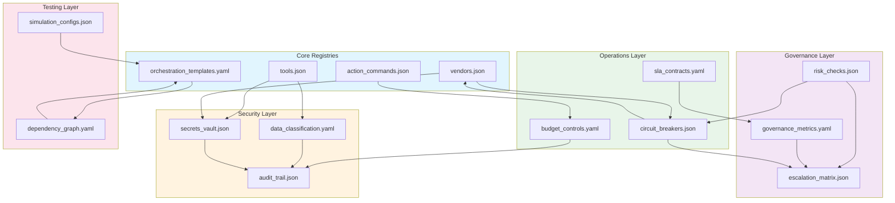
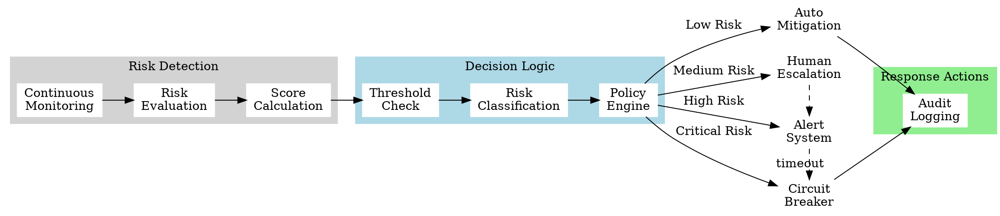
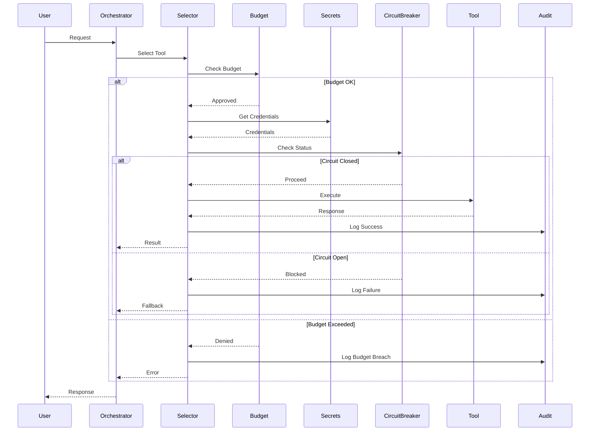

# Alpha Solver Registry Expansion: Enterprise-Grade Orchestration Architecture

## Part A: Newly Identified High-Level Gaps

### Critical Missing Components

1. **Secrets Management Registry** (`secrets_vault.json`)
   - **Justification**: Enterprise orchestration requires secure credential storage for API keys, tokens, and certificates across multiple vendors/tools. Without centralized secrets management, credentials risk exposure in configuration files.

2. **Budget & Cost Controls** (`budget_controls.yaml`)
   - **Justification**: Need spend limits, cost allocation, and financial guardrails for tool usage (especially LLM API calls). Uncontrolled spending on AI services can quickly exceed budgets.

3. **Audit Trail Registry** (`audit_trail.json`)
   - **Justification**: Compliance requires immutable logging of all orchestration decisions, tool calls, and governance actions. SOC2, ISO27001, and GDPR mandate comprehensive audit trails.

4. **SLA & Performance Contracts** (`sla_contracts.yaml`)
   - **Justification**: Enterprise SLAs need enforcement mechanisms for response times, availability, and quality metrics. Without SLA tracking, service degradation goes unnoticed.

5. **Simulation & Testing Framework** (`simulation_configs.json`)
   - **Justification**: Dry-run capabilities essential for testing orchestration flows before production deployment. Prevents costly mistakes and validates changes safely.

6. **Dependency Graph Registry** (`dependency_graph.yaml`)
   - **Justification**: Track tool/vendor dependencies and circular reference prevention. Complex orchestrations can create hidden dependencies leading to cascading failures.

7. **Circuit Breaker Patterns** (`circuit_breakers.json`)
   - **Justification**: Fault tolerance for vendor failures and cascading error prevention. Without circuit breakers, a single vendor failure can bring down entire workflows.

8. **Data Classification Schema** (`data_classification.yaml`)
   - **Justification**: PII/PHI/confidential data routing rules for compliance (GDPR, HIPAA). Mishandling sensitive data creates legal liability and regulatory penalties.

## Part B: JSON/YAML Stubs for New Registries

### secrets_vault.json
```json
{
  "version": "1.0.0",
  "schema_version": "1.0.0",
  "last_updated": "2024-01-15T00:00:00Z",
  "secrets": {
    "sec.openai.prod": {
      "id": "sec.openai.prod",
      "provider": "openai",
      "environment": "production",
      "type": "api_key",
      "vault_path": "/secrets/vendors/openai/prod",
      "rotation_days": 90,
      "last_rotated": "2024-01-01T00:00:00Z",
      "permissions": ["orchestrator", "selector"],
      "encryption": "AES-256-GCM"
    },
    "sec.anthropic.dev": {
      "id": "sec.anthropic.dev",
      "provider": "anthropic",
      "environment": "development",
      "type": "api_key",
      "vault_path": "/secrets/vendors/anthropic/dev",
      "rotation_days": 30,
      "last_rotated": "2024-01-10T00:00:00Z",
      "permissions": ["sandbox", "testing"],
      "encryption": "AES-256-GCM"
    },
    "sec.azure.oauth": {
      "id": "sec.azure.oauth",
      "provider": "azure",
      "environment": "production",
      "type": "oauth_token",
      "vault_path": "/secrets/vendors/azure/oauth",
      "rotation_days": 7,
      "refresh_endpoint": "https://login.microsoftonline.com/oauth2/v2.0/token",
      "permissions": ["orchestrator"],
      "encryption": "AES-256-GCM"
    }
  },
  "vault_config": {
    "provider": "hashicorp_vault",
    "endpoint": "https://vault.internal:8200",
    "auth_method": "kubernetes",
    "namespace": "alpha-solver",
    "kv_version": 2,
    "transit_key": "alpha-solver-transit"
  }
}
```

### budget_controls.yaml
```yaml
version: 1.0.0
schema_version: 1.0.0
last_updated: 2024-01-15T00:00:00Z

budgets:
  bud.global.monthly:
    id: bud.global.monthly
    scope: global
    period: monthly
    limit_usd: 50000
    current_spend: 12543.67
    alerts:
      - threshold_percent: 50
        notify: ["finance@company.com"]
      - threshold_percent: 80
        notify: ["cto@company.com", "finance@company.com"]
      - threshold_percent: 95
        action: throttle
      - threshold_percent: 100
        action: halt
    tags:
      - critical
      - monitored

  bud.vendor.openai:
    id: bud.vendor.openai
    vendor: openai
    period: daily
    limit_usd: 1000
    rate_limits:
      requests_per_minute: 500
      tokens_per_minute: 90000
    cost_per_unit:
      gpt-4: 0.03
      gpt-3.5-turbo: 0.002
      embedding-ada-002: 0.0001
    burst_allowance: 1.2

  bud.dept.engineering:
    id: bud.dept.engineering
    department: engineering
    period: monthly
    limit_usd: 15000
    approved_tools: ["t001", "t002", "t003"]
    approval_required_above: 500
    
cost_allocation:
  - pattern: "project.*"
    tag: project_code
    chargeback: true
  - pattern: "user.*"
    tag: cost_center
    chargeback: false
  - pattern: "experiment.*"
    tag: r_and_d
    chargeback: false
```

### audit_trail.json
```json
{
  "version": "1.0.0",
  "schema_version": "1.0.0",
  "audit_config": {
    "retention_days": 2555,
    "immutable_storage": true,
    "encryption_at_rest": "AES-256",
    "compliance_standards": ["SOC2", "ISO27001", "GDPR"],
    "tamper_detection": true,
    "blockchain_anchor": false
  },
  "event_types": {
    "aud.orchestration.start": {
      "id": "aud.orchestration.start",
      "severity": "info",
      "required_fields": ["session_id", "user", "intent", "timestamp", "ip_address"],
      "pii_fields": ["user", "ip_address"],
      "retention_override": null,
      "searchable": true
    },
    "aud.tool.invocation": {
      "id": "aud.tool.invocation",
      "severity": "info",
      "required_fields": ["tool_id", "vendor", "cost", "duration_ms", "status", "tokens_used"],
      "pii_fields": [],
      "retention_override": null,
      "searchable": true
    },
    "aud.risk.triggered": {
      "id": "aud.risk.triggered",
      "severity": "warning",
      "required_fields": ["risk_id", "score", "mitigation_action", "escalation_path"],
      "pii_fields": [],
      "retention_override": 3650,
      "searchable": true,
      "alert_security": true
    },
    "aud.data.sensitive": {
      "id": "aud.data.sensitive",
      "severity": "critical",
      "required_fields": ["classification", "handling_method", "jurisdiction", "user"],
      "pii_fields": ["data_sample", "user"],
      "retention_override": 2555,
      "searchable": false,
      "alert_security": true,
      "alert_privacy": true
    },
    "aud.budget.exceeded": {
      "id": "aud.budget.exceeded",
      "severity": "warning",
      "required_fields": ["budget_id", "limit", "actual", "action_taken"],
      "pii_fields": [],
      "retention_override": 1095,
      "searchable": true
    }
  }
}
```

### sla_contracts.yaml
```yaml
version: 1.0.0
schema_version: 1.0.0

contracts:
  sla.standard:
    id: sla.standard
    tier: standard
    availability: 99.5
    response_time_p50_ms: 500
    response_time_p99_ms: 2000
    support_hours: "business"
    escalation_time_minutes: 120
    measurement_period: monthly
    
  sla.premium:
    id: sla.premium
    tier: premium
    availability: 99.9
    response_time_p50_ms: 200
    response_time_p99_ms: 1000
    support_hours: "24x7"
    escalation_time_minutes: 30
    measurement_period: monthly
    penalties:
      - breach_type: availability
        threshold: 99.5
        credit_percent: 10
      - breach_type: availability
        threshold: 99.0
        credit_percent: 25
      - breach_type: response_time
        threshold_p99_ms: 2000
        credit_percent: 5

  sla.enterprise:
    id: sla.enterprise
    tier: enterprise
    availability: 99.95
    response_time_p50_ms: 100
    response_time_p99_ms: 500
    support_hours: "24x7"
    escalation_time_minutes: 15
    dedicated_support: true
    custom_metrics: true

performance_targets:
  perf.llm.latency:
    id: perf.llm.latency
    metric: latency
    target_p50_ms: 300
    target_p99_ms: 1500
    measurement_window: "5m"
    breaching_action: "alert"
    
  perf.orchestration.throughput:
    id: perf.orchestration.throughput
    metric: requests_per_second
    target_min: 100
    target_max: 10000
    autoscale_enabled: true
    scale_up_threshold: 0.8
    scale_down_threshold: 0.3
```

### simulation_configs.json
```json
{
  "version": "1.0.0",
  "schema_version": "1.0.0",
  "simulation_modes": {
    "sim.dryrun": {
      "id": "sim.dryrun",
      "name": "Dry Run",
      "execute_actions": false,
      "mock_responses": true,
      "cost_estimation": true,
      "risk_analysis": true,
      "output_plan": true,
      "save_results": true
    },
    "sim.replay": {
      "id": "sim.replay",
      "name": "Historical Replay",
      "source": "audit_trail",
      "time_range": "configurable",
      "speed_multiplier": 10,
      "compare_outputs": true,
      "detect_drift": true
    },
    "sim.chaos": {
      "id": "sim.chaos",
      "name": "Chaos Testing",
      "failure_injection": {
        "vendor_timeout": 0.1,
        "api_error": 0.05,
        "rate_limit": 0.15,
        "data_corruption": 0.01
      },
      "test_recovery": true,
      "measure_mttr": true
    },
    "sim.load": {
      "id": "sim.load",
      "name": "Load Testing",
      "concurrent_users": 1000,
      "requests_per_second": 500,
      "duration_minutes": 60,
      "ramp_up_seconds": 300,
      "measure_degradation": true
    },
    "sim.disaster": {
      "id": "sim.disaster",
      "name": "Disaster Recovery",
      "scenarios": ["datacenter_loss", "vendor_outage", "network_partition"],
      "measure_rto": true,
      "measure_rpo": true
    }
  },
  "test_scenarios": {
    "scn.vendor_failover": {
      "id": "scn.vendor_failover",
      "description": "Test fallback vendor activation",
      "inject_failure": "vendor.primary",
      "expected_behavior": "auto_failover",
      "success_criteria": ["no_data_loss", "latency_under_sla", "cost_controlled"]
    },
    "scn.budget_breach": {
      "id": "scn.budget_breach",
      "description": "Test budget control mechanisms",
      "inject_spend": "150_percent",
      "expected_behavior": "throttle_then_halt",
      "success_criteria": ["alerts_sent", "spending_stopped"]
    }
  }
}
```

### dependency_graph.yaml
```yaml
version: 1.0.0
schema_version: 1.0.0

dependencies:
  dep.core.loader:
    id: dep.core.loader
    module: loader
    depends_on: []
    required_by: ["selector", "planner", "orchestrator"]
    criticality: essential
    startup_order: 1
    
  dep.core.selector:
    id: dep.core.selector
    module: selector
    depends_on: ["loader"]
    required_by: ["planner", "orchestrator"]
    criticality: essential
    startup_order: 2
    
  dep.tool.t001:
    id: dep.tool.t001
    tool: t001
    depends_on: ["vendor.openai", "sec.openai.prod"]
    conflicts_with: []
    version_constraints: ">=1.0.0"
    optional: false
    
  dep.vendor.openai:
    id: dep.vendor.openai
    vendor: openai
    depends_on: ["network.egress", "secrets.api_key"]
    health_check: "https://api.openai.com/v1/health"
    timeout_seconds: 30
    retry_policy: exponential_backoff
    
  dep.vendor.anthropic:
    id: dep.vendor.anthropic
    vendor: anthropic
    depends_on: ["network.egress", "secrets.api_key"]
    health_check: "https://api.anthropic.com/health"
    timeout_seconds: 30
    retry_policy: exponential_backoff

circular_detection:
  enabled: true
  max_depth: 10
  fail_on_circular: true
  detection_algorithm: "tarjan"
  
resolution_strategy:
  missing_optional: warn
  missing_required: fail
  version_conflict: newest
  circular_dependency: fail
```

### circuit_breakers.json
```json
{
  "version": "1.0.0",
  "schema_version": "1.0.0",
  "breakers": {
    "cb.vendor.default": {
      "id": "cb.vendor.default",
      "failure_threshold": 5,
      "success_threshold": 2,
      "timeout_seconds": 60,
      "half_open_requests": 3,
      "monitoring_window_seconds": 120,
      "error_types": ["timeout", "500", "503", "rate_limit"],
      "exclude_errors": ["400", "401", "403"]
    },
    "cb.tool.critical": {
      "id": "cb.tool.critical",
      "failure_threshold": 3,
      "success_threshold": 5,
      "timeout_seconds": 30,
      "half_open_requests": 1,
      "monitoring_window_seconds": 60,
      "fallback_action": "use_cache",
      "alert_on_open": true
    },
    "cb.vendor.expensive": {
      "id": "cb.vendor.expensive",
      "failure_threshold": 2,
      "success_threshold": 3,
      "timeout_seconds": 45,
      "cost_threshold_usd": 10,
      "monitoring_window_seconds": 300
    }
  },
  "states": {
    "closed": {
      "allow_requests": true,
      "track_metrics": true,
      "log_level": "info"
    },
    "open": {
      "allow_requests": false,
      "fallback_enabled": true,
      "alert_ops": true,
      "log_level": "error"
    },
    "half_open": {
      "allow_requests": "limited",
      "test_recovery": true,
      "log_level": "warn"
    }
  },
  "global_config": {
    "enabled": true,
    "default_timeout_ms": 30000,
    "metrics_endpoint": "/metrics/circuit_breakers",
    "dashboard_enabled": true
  }
}
```

### data_classification.yaml
```yaml
version: 1.0.0
schema_version: 1.0.0

classifications:
  class.public:
    id: class.public
    level: public
    color_code: green
    restrictions: []
    allowed_vendors: all
    encryption_required: false
    can_cache: true
    
  class.internal:
    id: class.internal
    level: internal
    color_code: yellow
    restrictions: ["no_external_sharing"]
    allowed_vendors: ["approved_list"]
    encryption_required: false
    can_cache: true
    audit_access: false
    
  class.confidential:
    id: class.confidential
    level: confidential
    color_code: orange
    restrictions: ["no_external_sharing", "audit_required", "need_to_know"]
    allowed_vendors: ["enterprise_only"]
    encryption_required: true
    retention_days: 1095
    can_cache: false
    audit_access: true
    
  class.pii:
    id: class.pii
    level: pii
    color_code: red
    regulations: ["GDPR", "CCPA", "PIPEDA"]
    restrictions: ["encryption_required", "no_third_party", "right_to_delete", "consent_required"]
    allowed_vendors: ["privacy_certified"]
    encryption_required: true
    anonymization_required: true
    retention_days: 730
    can_cache: false
    audit_access: true
    
  class.phi:
    id: class.phi
    level: phi
    color_code: red
    regulations: ["HIPAA", "HITECH"]
    restrictions: ["baa_required", "audit_trail", "encryption_transit_rest", "minimum_necessary"]
    allowed_vendors: ["hipaa_compliant"]
    encryption_required: true
    access_control: "role_based"
    retention_days: 2190
    can_cache: false
    audit_access: true

detection_patterns:
  - pattern: "\\b\\d{3}-\\d{2}-\\d{4}\\b"
    classification: class.pii
    type: ssn
    confidence: high
  - pattern: "\\b[A-Z0-9._%+-]+@[A-Z0-9.-]+\\.[A-Z]{2,}\\b"
    classification: class.pii
    type: email
    confidence: high
  - pattern: "\\b(?:\\d{4}[-\\s]?){3}\\d{4}\\b"
    classification: class.pii
    type: credit_card
    confidence: medium
  - pattern: "\\b(MRN|Patient ID):\\s*\\w+"
    classification: class.phi
    type: medical_record
    confidence: high

handling_rules:
  masking:
    pii: "partial"
    phi: "full"
    confidential: "none"
  transmission:
    pii: "encrypted"
    phi: "encrypted_and_signed"
    confidential: "encrypted"
```

## Part C: Cross-Link Table

| Source Registry | Target Registry | Link Type | Description |
|-----------------|-----------------|-----------|-------------|
| risk_checks.json | escalation_matrix.json | Trigger | Risk scores above threshold trigger escalation paths |
| risk_checks.json | circuit_breakers.json | Activation | High risk scores activate circuit breakers |
| budget_controls.yaml | action_commands.json | Constraint | Budget limits constrain action execution |
| budget_controls.yaml | audit_trail.json | Logging | All budget events logged to audit trail |
| secrets_vault.json | vendors.json | Authentication | Secrets required for vendor authentication |
| data_classification.yaml | vendors.json | Filtering | Data classification restricts vendor selection |
| data_classification.yaml | audit_trail.json | Compliance | Sensitive data handling requires audit logging |
| sla_contracts.yaml | governance_metrics.yaml | Measurement | SLA metrics feed governance dashboard |
| dependency_graph.yaml | orchestration_templates.yaml | Validation | Dependencies validate template execution order |
| circuit_breakers.json | vendors.json | Fallback | Circuit breaker triggers vendor fallback |
| simulation_configs.json | orchestration_templates.yaml | Testing | Simulations test orchestration flows |
| governance_metrics.yaml | escalation_matrix.json | Threshold | Metric breaches trigger escalation |
| secrets_vault.json | audit_trail.json | Security | Secret access logged for security audit |
| circuit_breakers.json | escalation_matrix.json | Alert | Open circuit triggers operational escalation |
| data_classification.yaml | budget_controls.yaml | Cost | Sensitive data may have higher processing costs |
| sla_contracts.yaml | circuit_breakers.json | Protection | SLA breaches can trigger protective circuits |
| dependency_graph.yaml | circuit_breakers.json | Cascade | Dependency failures cascade to breakers |

## Part D: Diagram Code

### Registry Interdependency Graph (Mermaid)


### Policy/Risk Escalation Flow (Graphviz)


### Tool Execution Pipeline (Mermaid)


## Part E: Schema Rules for New Files

### JSON Schema for secrets_vault.json
```json
{
  "$schema": "http://json-schema.org/draft-07/schema#",
  "title": "Secrets Vault Registry",
  "type": "object",
  "required": ["version", "schema_version", "secrets", "vault_config"],
  "properties": {
    "version": {
      "type": "string",
      "pattern": "^\\d+\\.\\d+\\.\\d+$",
      "description": "Semantic version of the registry"
    },
    "schema_version": {
      "type": "string",
      "pattern": "^\\d+\\.\\d+\\.\\d+$",
      "description": "Schema version for validation"
    },
    "last_updated": {
      "type": "string",
      "format": "date-time"
    },
    "secrets": {
      "type": "object",
      "patternProperties": {
        "^sec\\..*": {
          "type": "object",
          "required": ["id", "provider", "type", "vault_path"],
          "properties": {
            "id": {
              "type": "string",
              "pattern": "^sec\\..*",
              "description": "Unique secret identifier"
            },
            "provider": {
              "type": "string",
              "minLength": 1
            },
            "environment": {
              "enum": ["production", "staging", "development", "testing"]
            },
            "type": {
              "enum": ["api_key", "oauth_token", "certificate", "password", "jwt", "webhook_secret"]
            },
            "vault_path": {
              "type": "string",
              "pattern": "^/.*"
            },
            "rotation_days": {
              "type": "integer",
              "minimum": 1,
              "maximum": 365
            },
            "permissions": {
              "type": "array",
              "items": {
                "type": "string"
              },
              "minItems": 1
            },
            "encryption": {
              "enum": ["AES-256-GCM", "AES-256-CBC", "RSA-4096"]
            }
          }
        }
      },
      "additionalProperties": false
    },
    "vault_config": {
      "type": "object",
      "required": ["provider", "endpoint"],
      "properties": {
        "provider": {
          "enum": ["hashicorp_vault", "aws_secrets_manager", "azure_key_vault", "gcp_secret_manager"]
        },
        "endpoint": {
          "type": "string",
          "format": "uri"
        },
        "auth_method": {
          "enum": ["kubernetes", "token", "ldap", "aws_iam", "azure_msi"]
        }
      }
    }
  }
}
```

### YAML Schema for budget_controls.yaml
```yaml
$schema: http://json-schema.org/draft-07/schema#
title: Budget Controls Registry
type: object
required: [version, schema_version, budgets]
properties:
  version:
    type: string
    pattern: '^\d+\.\d+\.\d+$'
  schema_version:
    type: string
    pattern: '^\d+\.\d+\.\d+$'
  budgets:
    type: object
    patternProperties:
      '^bud\..*':
        type: object
        required: [id, scope, period, limit_usd]
        properties:
          id:
            type: string
            pattern: '^bud\..*'
          scope:
            enum: [global, vendor, department, project, user]
          period:
            enum: [hourly, daily, weekly, monthly, quarterly, annual]
          limit_usd:
            type: number
            minimum: 0
            maximum: 1000000
          current_spend:
            type: number
            minimum: 0
          alerts:
            type: array
            items:
              type: object
              required: [threshold_percent]
              properties:
                threshold_percent:
                  type: integer
                  minimum: 1
                  maximum: 100
                notify:
                  type: array
                  items:
                    type: string
                    format: email
                action:
                  enum: [notify, throttle, halt, escalate]
          rate_limits:
            type: object
            properties:
              requests_per_minute:
                type: integer
                minimum: 1
              tokens_per_minute:
                type: integer
                minimum: 1
```

### JSON Schema for circuit_breakers.json
```json
{
  "$schema": "http://json-schema.org/draft-07/schema#",
  "title": "Circuit Breakers Registry",
  "type": "object",
  "required": ["version", "schema_version", "breakers", "states"],
  "properties": {
    "version": {
      "type": "string",
      "pattern": "^\\d+\\.\\d+\\.\\d+$"
    },
    "breakers": {
      "type": "object",
      "patternProperties": {
        "^cb\\..*": {
          "type": "object",
          "required": ["id", "failure_threshold", "success_threshold", "timeout_seconds"],
          "properties": {
            "id": {
              "type": "string",
              "pattern": "^cb\\..*"
            },
            "failure_threshold": {
              "type": "integer",
              "minimum": 1,
              "maximum": 100
            },
            "success_threshold": {
              "type": "integer",
              "minimum": 1,
              "maximum": 100
            },
            "timeout_seconds": {
              "type": "integer",
              "minimum": 1,
              "maximum": 3600
            },
            "half_open_requests": {
              "type": "integer",
              "minimum": 1,
              "maximum": 10
            },
            "monitoring_window_seconds": {
              "type": "integer",
              "minimum": 10,
              "maximum": 3600
            },
            "error_types": {
              "type": "array",
              "items": {
                "type": "string"
              }
            },
            "fallback_action": {
              "enum": ["use_cache", "use_default", "return_error", "use_fallback_vendor"]
            }
          }
        }
      }
    },
    "states": {
      "type": "object",
      "required": ["closed", "open", "half_open"],
      "properties": {
        "closed": {
          "type": "object",
          "required": ["allow_requests"],
          "properties": {
            "allow_requests": {
              "type": "boolean"
            }
          }
        },
        "open": {
          "type": "object",
          "required": ["allow_requests"],
          "properties": {
            "allow_requests": {
              "type": "boolean"
            },
            "fallback_enabled": {
              "type": "boolean"
            }
          }
        },
        "half_open": {
          "type": "object",
          "required": ["allow_requests"],
          "properties": {
            "allow_requests": {
              "enum": ["limited", true, false]
            }
          }
        }
      }
    }
  }
}
```

## Part F: Proposed Execution Modes

### 1. Sandbox Research Mode
```yaml
execution_mode: sandbox_research
description: "Experimental mode for testing new tools and workflows without production constraints"
weights:
  cost: 0.1  # Minimize cost concern for experimentation
  latency: 0.2  # Some speed matters but not critical
  quality: 0.4  # Focus on exploration quality
  safety: 0.3  # Maintain safety even in sandbox

features:
  mock_external_calls: false  # Real API calls for authentic testing
  budget_enforcement: soft  # Warn but don't block
  risk_tolerance: high  # Allow experimental patterns
  audit_level: verbose  # Detailed logging for analysis
  parallel_execution: true  # Test concurrent flows
  cache_ttl_seconds: 60  # Short cache for fresh results
  failure_injection: 0.05  # 5% random failures for resilience testing
  
constraints:
  max_spend_per_hour: 100
  blocked_vendors: []  # All vendors available
  data_classification: ["public", "internal"]  # No sensitive data
  escalation_enabled: false  # No production escalations
  retention_days: 30  # Short retention for experiments
  
monitoring:
  metrics_collection: detailed
  performance_profiling: enabled
  cost_tracking: itemized
  error_analysis: comprehensive
```

### 2. Regulated Environment Mode
```yaml
execution_mode: regulated_environment
description: "Compliance-first mode for healthcare, finance, and government sectors"
weights:
  cost: 0.15  # Cost matters but not primary concern
  latency: 0.15  # Speed less important than compliance
  quality: 0.30  # High quality required for accuracy
  safety: 0.40  # Maximum safety and compliance priority

features:
  mock_external_calls: false
  budget_enforcement: strict
  risk_tolerance: minimal
  audit_level: forensic  # Complete audit trail with signatures
  parallel_execution: false  # Sequential for full auditability
  cache_ttl_seconds: 0  # No caching of sensitive data
  encryption_everywhere: true  # All data encrypted at rest and in transit
  
constraints:
  max_spend_per_hour: 500
  blocked_vendors: ["non_compliant_list"]
  data_classification: ["public", "internal", "confidential", "pii", "phi"]
  escalation_enabled: true
  retention_days: 2555  # 7 years for compliance
  
compliance:
  standards: ["HIPAA", "GDPR", "SOC2", "ISO27001", "PCI-DSS"]
  encryption: required
  data_residency: ["US", "EU"]  # Geographic restrictions
  right_to_audit: true
  baa_required: true  # Business Associate Agreement for healthcare
  data_processing_agreement: true  # DPA for GDPR
  
governance:
  approval_required: ["phi_access", "bulk_operations", "cross_border"]
  four_eyes_principle: true  # Dual approval for critical operations
  change_control: enabled
  audit_retention_years: 7
  incident_response_sla: 4  # Hours
  
monitoring:
  compliance_dashboard: enabled
  privacy_metrics: enabled
  security_events: real_time
  regulatory_reporting: automated
```

### 3. High-Performance Mode (Bonus)
```yaml
execution_mode: high_performance
description: "Optimized for speed and throughput in production environments"
weights:
  cost: 0.25  # Balance cost with performance
  latency: 0.45  # Prioritize speed
  quality: 0.20  # Accept good-enough quality
  safety: 0.10  # Basic safety only

features:
  mock_external_calls: false
  budget_enforcement: monitoring  # Track but don't block
  risk_tolerance: moderate
  audit_level: minimal  # Only critical events
  parallel_execution: aggressive  # Maximum parallelization
  cache_ttl_seconds: 3600  # Aggressive caching
  connection_pooling: enabled
  batch_processing: enabled
  
optimizations:
  prefetch_predictions: true
  speculative_execution: true
  result_streaming: true
  compression: enabled
  
constraints:
  max_spend_per_hour: 2000
  blocked_vendors: ["slow_vendors"]
  data_classification: ["public", "internal", "confidential"]
  escalation_enabled: true
  
monitoring:
  apm_integration: enabled  # Application Performance Monitoring
  real_time_metrics: true
  latency_budgets: enforced
  slo_tracking: enabled
```

## Summary

This comprehensive expansion adds 8 critical registries to Alpha Solver's architecture, addressing enterprise requirements for security, compliance, cost control, and operational resilience. The new registries integrate seamlessly with existing components while maintaining the file-driven architecture principle.

Key additions include:
- **Security**: Secrets management and data classification
- **Operations**: Budget controls, SLAs, and circuit breakers
- **Compliance**: Comprehensive audit trails
- **Testing**: Simulation and dependency management
- **Execution Modes**: Three new modes for different operational contexts

The cross-linking table and diagrams illustrate how these new components create a robust, enterprise-grade orchestration framework capable of handling production workloads while maintaining governance and compliance requirements.
